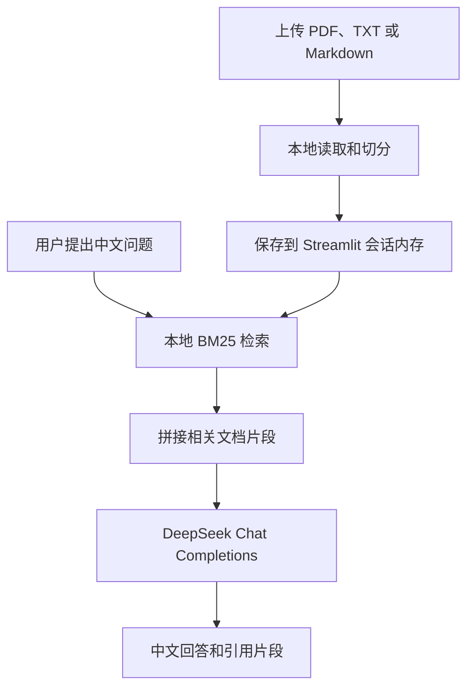

# 本地 DeepSeek RAG 文档问答

这是一个轻量级本地 RAG 示例：文档在本地读取和切分，使用 BM25 检索相关片段，再调用 DeepSeek 生成中文回答。

## 功能

- 支持 PDF、TXT 和 Markdown 文件
- 本地内存检索，不依赖 Qdrant Cloud
- DeepSeek 直接 HTTP 接口，不使用 OpenAI SDK
- 不依赖 Ollama、Exa、Google、代理或外部搜索服务
- 回答明确区分文档事实和信息不足情况
- 支持查看回答引用的本地文档片段

## 运行

```bash
cd 09-deepseek_local_rag_agent
python -m pip install -r requirements.txt
```

在当前目录、`awesome-llm-apps` 根目录或工作区根目录的 `.env` 中配置：

```bash
DEEPSEEK_API_KEY=你的DeepSeek API Key
DEEPSEEK_BASE_URL=https://api.deepseek.com
DEEPSEEK_MODEL_ID=deepseek-chat
```

启动：

```bash
streamlit run deepseek_rag_agent.py --server.address 127.0.0.1 --server.port 8509
```

或从仓库根目录运行：

```bash
./scripts/run_09_agent.sh
```

访问 `http://127.0.0.1:8509`。

## 示例问题

- 这份材料的核心观点是什么？
- 文档中提到哪些风险和限制？
- 请整理文档中的关键数字，并标注来源文件。
- 不同方案的优缺点分别是什么？
- 根据文档内容，还需要补充哪些信息？

## 代码流程图



## 代码解读

核心代码位于 `deepseek_rag_agent.py`，可以按下面四个部分阅读：

1. **环境配置**

   程序使用 `Path` 定位当前项目，并依次尝试加载项目目录、`awesome-llm-apps` 根目录和工作区根目录的 `.env`。`call_deepseek()` 从环境变量读取 `DEEPSEEK_API_KEY`、`DEEPSEEK_BASE_URL` 和 `DEEPSEEK_MODEL_ID`，通过 `requests` 直接调用 DeepSeek 的 `/chat/completions` 接口。

2. **文档读取和切分**

   `read_uploaded_file()` 根据文件后缀处理 PDF、TXT 和 Markdown。PDF 使用 `pypdf.PdfReader` 提取页面文字，文本文件直接按 UTF-8 读取。`split_text()` 将长文本切成带少量重叠的片段，避免一次请求携带整份文档。

3. **本地检索**

   `tokenize()` 把问题和文本拆成英文单词、数字及中文单字。`retrieve()` 使用 `rank-bm25` 的 BM25 算法，根据词频、逆文档频率和文档长度计算相关性，返回得分最高的前 5 个片段。检索过程只使用本地内存，不访问向量数据库或外部搜索服务。

4. **回答和降级处理**

   用户提交问题后，程序先调用 `retrieve()`，再把命中的片段和问题拼接到提示词中交给 DeepSeek。DeepSeek 返回后，页面显示中文回答和引用片段；遇到 `429`、`5xx` 或网络异常时会自动重试 3 次。如果本地命中了文档但模型仍不可用，页面会降级展示本地检索结果，而不是丢失上下文。

这种实现把 RAG 拆成“读取、切分、检索、生成”四个容易替换的步骤，适合逐步学习。当前使用 BM25，是因为它不需要 GPU、不需要训练嵌入模型，也不需要外部 API；后续仍可以只替换 `retrieve()`，加入本地向量检索，而不需要改动界面和 DeepSeek 调用部分。

## 说明

本项目适合学习 RAG 的基本数据流。当前检索器使用轻量 BM25，重点是减少基础设施和网络依赖；生产环境可以在保持接口不变的前提下替换为本地向量数据库。

本项目仅用于技术学习和研究参考，不构成投资、法律或其他专业建议。
