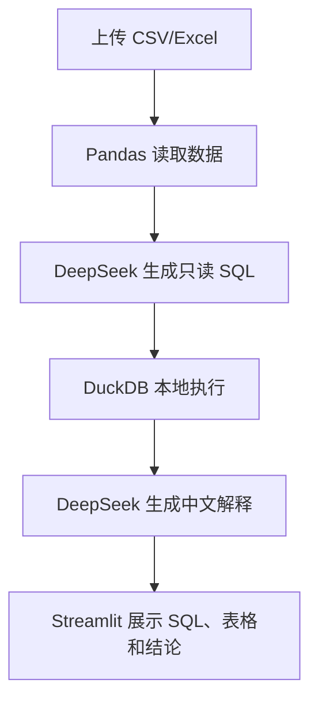

## AI 金融数据分析 Agent

这个应用支持上传 CSV 或 Excel 文件，用自然语言提出问题，由 DeepSeek 生成只读 DuckDB SQL，本地执行后再生成中文解释。

### 快速开始

```bash
cd 12-ai_financial_data_analysis_agent
pip install -r requirements.txt
streamlit run app.py
```

也可以从仓库根目录运行：

```bash
./scripts/run_12_agent.sh
```

需要在 `.env` 中配置：

```bash
DEEPSEEK_API_KEY=你的DeepSeek API Key
DEEPSEEK_BASE_URL=https://api.deepseek.com
DEEPSEEK_MODEL_ID=deepseek-chat
```

### 示例问题

- 按月份统计收入、成本和利润。
- 找出金额最大的前 20 笔交易，并解释异常点。
- 按客户汇总销售额，列出贡献最高的前 10 个客户。
- 计算每个部门的费用占比。
- 找出同比或环比变化最大的指标。

### 流程图



> 本项目仅用于技术学习与原型验证，不构成投资建议。
