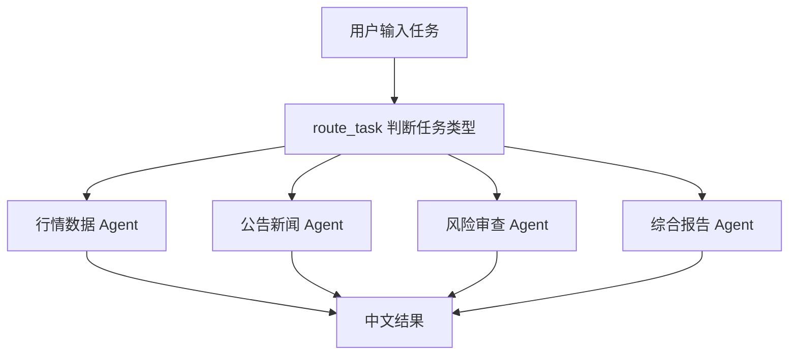

## 金融 MCP Agent Router

这个项目用本地 Streamlit 演示 MCP 风格的金融工具路由：根据用户任务自动选择行情数据、公告新闻、风险审查或综合报告 Agent。

### 运行

```bash
cd 15-finance_mcp_agent_router
pip install -r requirements.txt
streamlit run app.py
```

或从仓库根目录运行：

```bash
./scripts/run_15_agent.sh
```

### 示例任务

- 请分析 NVDA 的当前行情、最新新闻和主要风险。
- 找出最近影响 TSLA 股价的监管和市场事件。
- 请做一份 AAPL 风险审查报告。
- 比较 MSFT 和 GOOGL 的市场叙事差异。

### 流程图



> 本项目仅用于技术学习与原型验证，不构成投资建议。
