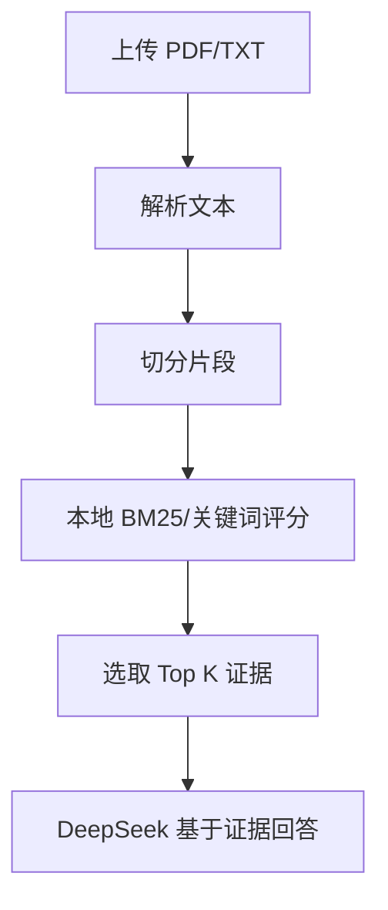

## 本地混合金融 RAG

这个项目用本地关键词/BM25 检索替代外部 Embedding 和 Rerank 服务，适合在财报、公告、研报上做可追溯问答。

### 运行

```bash
cd 16-local_hybrid_financial_rag
pip install -r requirements.txt
streamlit run app.py
```

或从仓库根目录运行：

```bash
./scripts/run_16_agent.sh
```

### 流程图



> 本项目仅用于技术学习与原型验证，不构成投资建议。
