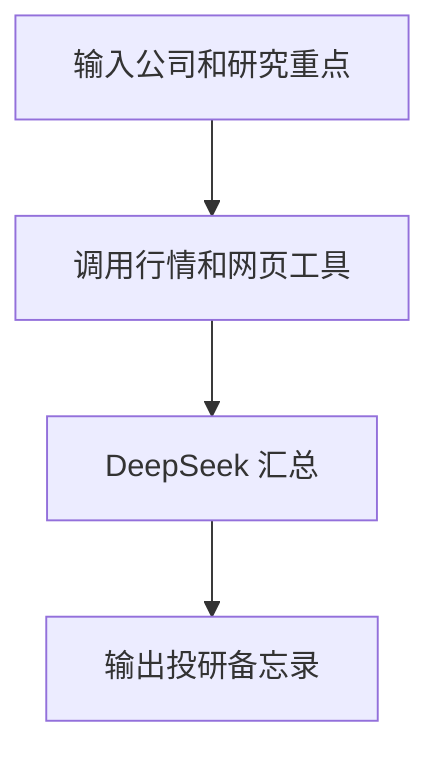

## 金融研究工作台

本地 Streamlit 投研工作台，用 DeepSeek、DuckDuckGo 和 Yahoo Finance 生成结构化研究备忘录。

```bash
cd 18-financial_research_workspace
pip install -r requirements.txt
streamlit run app.py
```

仓库根目录运行：

```bash
./scripts/run_18_agent.sh
```



> 本项目仅用于技术学习与原型验证，不构成投资建议。
