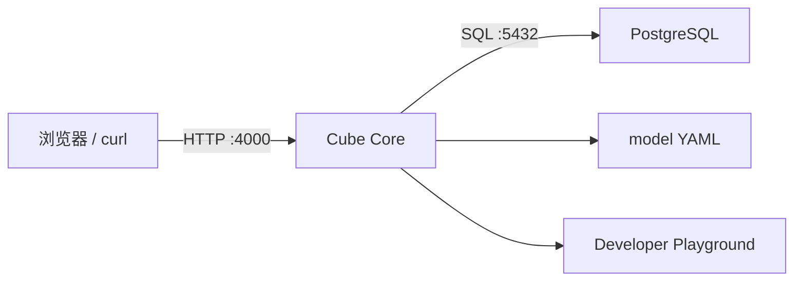

# 01：启动 Cube Core 与 PostgreSQL

## 学习目标

本章建立整个系列的运行底座。读完后应能解释 Cube 进程、源数据库和 Developer Playground 的职责，并能判断“服务启动失败”和“数据源连接失败”属于不同故障层。

> 当前目录处于规划阶段。下面出现的 `compose.yaml`、`model/` 和命令是本章实现目标，不表示文件已经存在。

## 最小架构



PostgreSQL 保存事实数据；Cube Core 加载模型、接收语义查询并连接 PostgreSQL；Playground 是开发期检查模型和查询的界面，不是生产 Dashboard。

## 为什么先用两个服务

把数据库和 Cube 放在独立容器里，可以清楚观察网络、凭据、初始化和健康检查。第一章不加入 Cube Store，因为尚未使用预聚合；不加入 Redis、前端和 LLM，因为它们不能帮助理解最小链路。

## 计划中的目录

```text
01-cube-core-and-postgres/
├── compose.yaml
├── .env.example
├── data/
│   ├── schema.sql
│   └── seed.sql
└── model/
```

数据库 fixture 必须固定，重复初始化得到相同数据。真实密钥放在未提交的 `.env`，`.env.example` 只保留无敏感信息的变量名和本地默认值。

## 需要理解的配置

Cube 需要知道数据库类型、主机、端口、数据库名和凭据。容器内的 `localhost` 指向容器自己，因此 Cube 连接 PostgreSQL 时应使用 Compose service name，而不是宿主机的 `127.0.0.1`。

开发模式会启用 Playground 和更适合调试的行为，但不应直接用于生产。镜像必须固定版本，不能用 `latest` 隐式升级整套教程。

## 预期操作

```bash
docker compose up -d
docker compose ps
docker compose logs cube
```

若仓库统一使用 Podman，等价命令将在实现时写入脚本。教程只保留一个主运行入口，避免 Docker 和 Podman 两套配置漂移。

## 如何验证

验证分四层：

1. PostgreSQL 容器健康。
2. fixture 表存在且行数固定。
3. Cube HTTP 健康检查可访问。
4. Cube 日志显示数据源连接成功。

只看到端口 4000 打开不能证明数据库已连接；只看到 PostgreSQL 可查询也不能证明 Cube 模型能编译。

## 故障实验

- 把数据库主机改成 `localhost`，观察容器网络错误。
- 修改密码，区分认证失败与网络不可达。
- 删除一个 fixture 表，观察后续模型编译或查询错误。
- 停止 PostgreSQL，确认 Cube 进程仍可能存在，但查询链路已经不可用。

## 验收标准

- 一条命令启动所需服务。
- 健康检查通过。
- PostgreSQL fixture 可重复初始化。
- Cube 能读取数据源；错误凭据会得到明确失败。

## 下一步

第 02 章将在这套基础设施上定义第一个 Cube，让 API 从“能连接数据库”进化到“能查询业务指标”。
