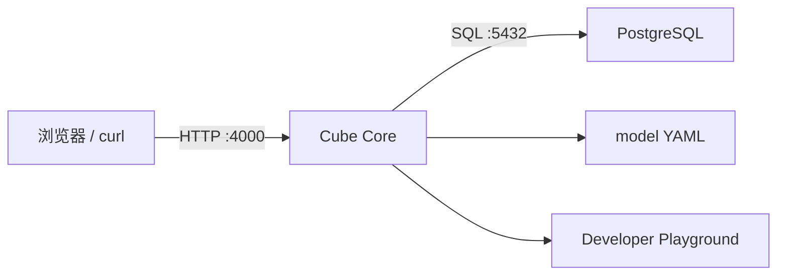

# 01：启动 Cube Core 与 PostgreSQL

## 学习目标

本章建立整个系列的运行底座。运行案例后应能解释 Cube Core（Cube 开源语义层服务）、源数据库和 Developer Playground（开发调试工作台）的职责，并能判断“服务启动失败”和“数据源连接失败”属于不同故障层。

## 最小架构



PostgreSQL 保存事实数据；Cube Core 加载模型、接收语义查询并连接 PostgreSQL；Playground 是开发期检查模型和查询的界面，不是生产 Dashboard（面向最终用户的数据看板）。

## 为什么先用两个服务

把数据库和 Cube 放在独立容器里，可以清楚观察网络、凭据、初始化和健康检查。第一章不加入 Cube Store，因为尚未使用预聚合；不加入 Redis、前端和 LLM，因为它们不能帮助理解最小链路。

## 目录

```text
cube-demos/
├── .env.example
├── compose.yaml
├── demo.sh
├── data/
│   ├── schema.sql
│   └── seed.sql
└── 01-cube-core-and-postgres/
    ├── demo.sh
    ├── model/
    │   └── fixture_health.yml
    └── test_demo.py
```

`.env.example`、Compose 和数据库 fixture 位于 `cube-demos` 根目录，供后续章节共用；本章目录只保留模型、章节验证脚本和测试。fixture 固定包含 6 张表。`demo.sh reset` 删除公共教学数据卷并重新初始化，结果始终一致。真实密钥放在未提交的 `cube-demos/.env`；模板中的值只用于本地教学，不能用于生产。

## 需要理解的配置

Cube 需要知道数据库类型、主机、端口、数据库名和凭据。容器内的 `localhost` 指向容器自己，因此 Cube 连接 PostgreSQL 时应使用 Compose service name，而不是宿主机的 `127.0.0.1`。

开发模式会启用 Playground 和更适合调试的行为，但不应直接用于生产。本例固定 Cube Core `v1.7.11` 和 PostgreSQL `16.14-alpine`，避免 `latest` 隐式升级。

宿主机 PostgreSQL 端口默认使用 `55432`，避免和常见的本地 `5432` 服务冲突。容器之间仍通过 Compose 网络上的 `postgres:5432` 通信。

## `4000` 端口负责什么

`4000` 是 Cube Core 的 HTTP（Hypertext Transfer Protocol，超文本传输协议）服务端口，不是一个独立的“管理端口”。当前案例开启开发模式后，同一个端口提供：

- Developer Playground（开发调试工作台）：浏览器访问 `http://127.0.0.1:4000`；
- REST API（基于 HTTP 和 JSON 的查询接口）：例如 `/cubejs-api/v1/load`；
- Meta API（元数据接口）：供客户端发现 Cube、measure（度量）和 dimension（维度）；
- readiness probe（就绪检查）`/readyz` 和 liveness probe（存活检查）`/livez`。

Playground 类似“查询调试器 + API 调试页面”：它可以选择语义成员、执行查询、预览结果并辅助检查模型，但不是生产管理后台，也不是交付给最终用户的 BI（Business Intelligence，商业智能）系统。`CUBEJS_DEV_MODE=true` 会关闭部分安全检查，因此只能用于本地开发。

## 为什么使用隔离容器

Compose 会复用本机已有的相同镜像缓存，但创建属于 `cube-demos` 学习路径的独立容器、网络和数据卷。第 01、02 章共用这套教学环境，但不直接向其他项目正在运行的 PostgreSQL 写入 fixture，也不复用带有其他模型挂载的 Cube 容器。

## Cube Core 安装与启动

Cube Core 以 Docker 镜像分发，本案例不在宿主机执行 `npm install`。首次运行时，Compose 会拉取固定版本的 `cubejs/cube:v1.7.11`；本机只需提前安装 Docker Compose 或 Podman Compose。

```bash
cd cube-demos/01-cube-core-and-postgres
./demo.sh
```

脚本会自动选择 Docker Compose 或 Podman Compose，复制 `.env.example` 为未提交的 `.env`，拉取镜像并启动 PostgreSQL 和 Cube，挂载 01 模型，轮询就绪状态，最后通过 Cube REST API 断言 fixture 行数。成功输出类似：

```text
fixture rows: {'daily_prices': 8, 'portfolios': 3, 'positions': 6, 'securities': 4, 'transactions': 8, 'users': 3}
Cube Playground: http://127.0.0.1:4000
Cube and PostgreSQL are ready.
```

常用命令：

```bash
./demo.sh verify  # 再次验证当前服务
./demo.sh logs    # 查看 Cube 和 PostgreSQL 日志
./demo.sh stop    # 停止本案例容器，保留数据卷
./demo.sh reset   # 删除本案例数据卷并重新初始化
```

## Playground 测试例子

这个例子用浏览器验证 `fixture_health` 模型能否通过 Cube 读取全部 PostgreSQL fixture 表。

1. 运行 `./demo.sh`，确认终端显示 `Cube and PostgreSQL are ready.`。
2. 打开 `http://127.0.0.1:4000`。
3. 进入 Playground 的 Build（查询构建）页面。
4. 在 `fixture_health` Cube 下选择两个 Dimensions（维度）：`table_name` 和 `row_count`。
5. 点击 Run Query（执行查询）。

预期得到以下 6 行；显示顺序可能不同：

| `table_name` | `row_count` |
|---|---:|
| `users` | 3 |
| `securities` | 4 |
| `daily_prices` | 8 |
| `portfolios` | 3 |
| `positions` | 6 |
| `transactions` | 8 |

Playground 在背后发送的 Cube Query（Cube 语义查询）等价于：

```json
{
  "dimensions": [
    "fixture_health.table_name",
    "fixture_health.row_count"
  ]
}
```

这里故意不选择 Measure（度量）。`fixture_health` 是本章专用的运行状态模型，`row_count` 已经由模型 SQL 计算完成，并作为 Dimension 暴露。第 02 章才会正式定义交易笔数、成交金额等业务 Measure。

如果 Playground 页面能打开但查询失败，说明 Cube HTTP 进程仍在运行，但模型编译或 PostgreSQL 数据链路存在问题。此时运行 `./demo.sh logs` 查看具体错误。

## 如何验证

可以分三步判断服务和数据连接状态。以下命令使用 Podman；Docker 用户将 `podman` 替换为 `docker`。

1. 验证 PostgreSQL 自身可用：

   ```bash
   cd cube-demos
   podman compose --env-file .env -f compose.yaml exec -T postgres \
     pg_isready -U cube -d finance
   ```

   输出 `accepting connections` 只说明 PostgreSQL 已就绪。

2. 验证 Cube Core 自身可用：

   ```bash
   curl http://127.0.0.1:4000/readyz
   ```

   返回成功响应说明 Cube HTTP 服务已就绪。仅能打开 4000 端口或 Playground，还不能单独证明 Cube 已成功查询 PostgreSQL。

3. 验证 Cube 到 PostgreSQL 的完整链路：

   ```bash
   cd cube-demos/01-cube-core-and-postgres
   ./demo.sh
   ```

   出现 `fixture rows: ...` 和 `Cube and PostgreSQL are ready.`，说明请求已经经过“客户端 → Cube 数据模型 → PostgreSQL → Cube 返回结果”，这是连接成功最直接的证明。已启动 01 模型时，也可以运行 `./demo.sh verify` 重新验证；失败时运行 `./demo.sh logs` 查看日志。

`demo.sh` 最终自动验证四项：

1. PostgreSQL 容器健康。
2. Cube readiness probe（就绪检查）`/readyz` 返回成功。
3. `fixture_health` 模型能通过 Cube 查询全部 fixture 表。
4. API 返回的 6 张表行数与固定基准完全一致。

只看到端口 4000 打开不能证明数据库已连接；只看到 PostgreSQL 可查询也不能证明 Cube 模型能编译。

静态验收测试不需要启动容器：

```bash
python3 -m unittest test_demo.py -v
```

测试检查固定镜像、服务名、fixture 完整性、健康模型和入口脚本契约。真实服务链路由 `./demo.sh verify` 验证。

## 故障实验

- 把 `compose.yaml` 中的 `CUBEJS_DB_HOST` 临时改成 `localhost`，运行 `./demo.sh reset`，观察容器网络错误；实验后改回 `postgres`。
- 让 `CUBEJS_DB_PASS` 与 `POSTGRES_PASSWORD` 不一致，区分认证失败与网络不可达。
- 删除一个 fixture 表，观察后续模型编译或查询错误。
- 停止 PostgreSQL，确认 Cube 进程仍可能存在，但查询链路已经不可用。

失败时先运行 `./demo.sh logs`。入口脚本使用有上限的轮询，不会用长时间固定 `sleep` 猜测服务状态。

## 验收标准

- `./demo.sh` 一条命令启动并验证所需服务。
- PostgreSQL 和 Cube 健康检查通过。
- `./demo.sh reset` 可重复初始化固定 fixture。
- Cube REST 查询返回 6 张表的预期行数；错误凭据会导致验证明确失败。

## 下一步

第 02 章将在这套基础设施上定义第一个 Cube，让 API 从“能连接数据库”进化到“能查询业务指标”。
