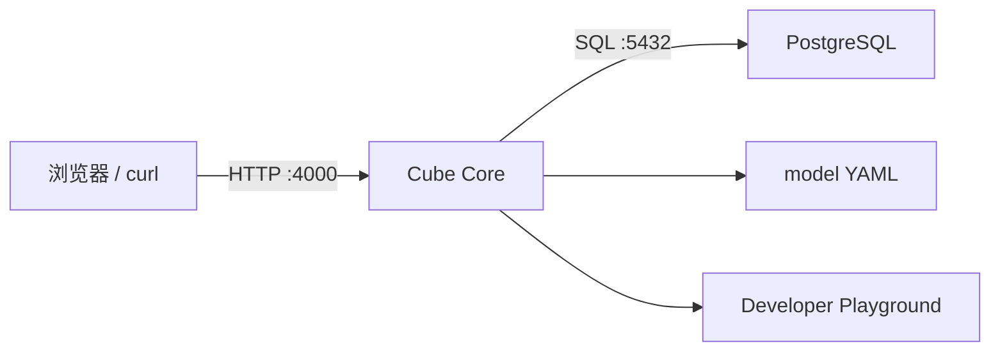

# 01：启动 Cube Core 与 PostgreSQL

## 学习目标

本章建立整个系列的运行底座。运行案例后应能解释 Cube 进程、源数据库和 Developer Playground 的职责，并能判断“服务启动失败”和“数据源连接失败”属于不同故障层。

## 最小架构



PostgreSQL 保存事实数据；Cube Core 加载模型、接收语义查询并连接 PostgreSQL；Playground 是开发期检查模型和查询的界面，不是生产 Dashboard。

## 为什么先用两个服务

把数据库和 Cube 放在独立容器里，可以清楚观察网络、凭据、初始化和健康检查。第一章不加入 Cube Store，因为尚未使用预聚合；不加入 Redis、前端和 LLM，因为它们不能帮助理解最小链路。

## 目录

```text
01-cube-core-and-postgres/
├── compose.yaml
├── .env.example
├── demo.sh
├── data/
│   ├── schema.sql
│   └── seed.sql
├── model/
│   └── fixture_health.yml
└── test_demo.py
```

数据库 fixture 固定包含 6 张表。`demo.sh reset` 删除本案例自己的数据卷并重新初始化，结果始终一致。真实密钥放在未提交的 `.env`；`.env.example` 中的值只用于本地教学，不能用于生产。

## 需要理解的配置

Cube 需要知道数据库类型、主机、端口、数据库名和凭据。容器内的 `localhost` 指向容器自己，因此 Cube 连接 PostgreSQL 时应使用 Compose service name，而不是宿主机的 `127.0.0.1`。

开发模式会启用 Playground 和更适合调试的行为，但不应直接用于生产。本例固定 Cube Core `v1.7.11` 和 PostgreSQL `16.14-alpine`，避免 `latest` 隐式升级。

宿主机 PostgreSQL 端口默认使用 `55432`，避免和常见的本地 `5432` 服务冲突。容器之间仍通过 Compose 网络上的 `postgres:5432` 通信。

## 为什么使用隔离容器

Compose 会复用本机已有的相同镜像缓存，但创建属于 `cube-demo-01` 的独立容器、网络和数据卷。不要直接向其他项目正在运行的 PostgreSQL 写入教学 fixture，也不要复用带有其他模型挂载的 Cube 容器；那会污染现有数据，并让本章结果依赖仓库外状态。

## 运行

```bash
cd cube-demos/01-cube-core-and-postgres
./demo.sh
```

脚本会自动选择 Docker Compose 或 Podman Compose，复制 `.env.example` 为未提交的 `.env`，启动服务，轮询就绪状态，并通过 Cube REST API 断言 fixture 行数。成功输出类似：

```text
fixture rows: {'daily_prices': 8, 'portfolios': 3, 'positions': 6, 'securities': 4, 'transactions': 8, 'users': 3}
Cube Playground: http://127.0.0.1:4000
Cube and PostgreSQL are ready.
```

常用命令：

```bash
./demo.sh verify  # 再次验证当前服务
./demo.sh logs    # 查看 Cube 和 PostgreSQL 日志
./demo.sh stop    # 停止本案例容器，保留数据卷
./demo.sh reset   # 删除本案例数据卷并重新初始化
```

## 如何验证

`demo.sh` 验证四层：

1. PostgreSQL 容器健康。
2. Cube `/readyz` 返回成功。
3. `fixture_health` 模型能通过 Cube 查询全部 fixture 表。
4. API 返回的 6 张表行数与固定基准完全一致。

只看到端口 4000 打开不能证明数据库已连接；只看到 PostgreSQL 可查询也不能证明 Cube 模型能编译。

静态验收测试不需要启动容器：

```bash
python3 -m unittest test_demo.py -v
```

测试检查固定镜像、服务名、fixture 完整性、健康模型和入口脚本契约。真实服务链路由 `./demo.sh verify` 验证。

## 故障实验

- 把 `compose.yaml` 中的 `CUBEJS_DB_HOST` 临时改成 `localhost`，运行 `./demo.sh reset`，观察容器网络错误；实验后改回 `postgres`。
- 让 `CUBEJS_DB_PASS` 与 `POSTGRES_PASSWORD` 不一致，区分认证失败与网络不可达。
- 删除一个 fixture 表，观察后续模型编译或查询错误。
- 停止 PostgreSQL，确认 Cube 进程仍可能存在，但查询链路已经不可用。

失败时先运行 `./demo.sh logs`。入口脚本使用有上限的轮询，不会用长时间固定 `sleep` 猜测服务状态。

## 验收标准

- `./demo.sh` 一条命令启动并验证所需服务。
- PostgreSQL 和 Cube 健康检查通过。
- `./demo.sh reset` 可重复初始化固定 fixture。
- Cube REST 查询返回 6 张表的预期行数；错误凭据会导致验证明确失败。

## 下一步

第 02 章将在这套基础设施上定义第一个 Cube，让 API 从“能连接数据库”进化到“能查询业务指标”。
