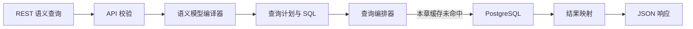

# 03：构建时间序列指标

## 学习目标

理解 Time Dimension（时间维度）、Granularity（粒度）、Date Range（日期范围）、Filter（过滤器）和 Timezone（时区）如何共同决定时间序列结果，并验证日/月聚合没有漏数或重复计算。

本章直接复用第 02 章的 `transactions` 模型和根目录公共环境，不复制模型、Compose、`.env` 或数据库 fixture。

一句话理解：第 02 章定义指标“是什么”，第 03 章学习这些指标“按什么时间范围和粒度汇总”。02 模型中的中文 `title` 和 `description` 也会直接显示在本章 Playground 中；REST API 仍使用 `transactions.count` 等英文成员名。

## 时间维度不是普通字符串

第 02 章已将 `traded_at` 声明为：

```yaml
- name: traded_at
  sql: traded_at
  type: time
```

`type: time` 让 Cube 可以按年、季度、月、周、日等粒度分组。粒度与过滤范围职责不同：

- `granularity: day` 决定按日生成结果桶；
- `dateRange` 决定哪些原始交易进入计算；
- `timezone: UTC` 决定日期边界按哪个时区解释；
- `filters` 在聚合前限制原始数据。

## Cube 底层处理链路

Cube Core 不是保存交易明细的数据库，也不会在应用进程中逐行求和。它的核心职责是“理解统一的业务定义、生成正确 SQL、编排查询”；本章的数据扫描和聚合最终由 PostgreSQL 负责实际计算。



1. **API 校验**：检查 `transactions.total_amount` 等成员是否存在、时间粒度是否合法，并在访问数据库前应用安全上下文和访问策略。不存在的成员会直接返回 HTTP 400。
2. **模型编译**：语义模型编译器读取 02 的 YAML，把 `total_amount` 展开为 `SUM(quantity * price)`，把 `count` 展开为 `COUNT(*)`；客户端不能临时改写指标口径。
3. **查询计划**：Cube 把 Date Range 和普通维度 Filter 变成原始数据过滤，把 Timezone 用于解释日期边界和时间桶，再按照 PostgreSQL 方言生成 SQL。维度过滤通常进入 `WHERE`，Measure 过滤则作用于聚合结果，语义上类似 `HAVING`。
4. **查询编排**：查询编排器负责缓存键、刷新状态、并发队列和预聚合匹配。如果内存缓存有效，Cube 可以直接返回；否则继续执行查询。
5. **选择数据来源**：配置预聚合后，Cube 会优先选择能覆盖当前 Measure、Dimension、Filter 和 Granularity 的汇总表。当前 03 没有配置预聚合或 Cube Store，所以缓存未命中时直接查询 PostgreSQL 原始表。
6. **结果映射**：数据库返回带 SQL 别名的行后，Cube 将其映射回 `transactions.traded_at.day`、`transactions.total_amount` 等语义成员名，再序列化为 REST JSON。

因此，本章可以简单理解为：**模型决定算什么，Cube 决定怎样安全地查，PostgreSQL 执行真正的过滤、分组和聚合。**

## Cube 如何完成时间聚合

以“按日统计”为例，请求和数据库之间依次发生：

1. 客户端选择时间成员 `transactions.traded_at`、粒度 `day` 和所需 Measure。
2. Cube 根据第 02 章定义的 `type: time`、`type: count` 和 `type: sum` 校验请求。
3. Cube 生成并执行类似下面的 PostgreSQL SQL；实际 SQL 还会包含别名和时区处理。
4. PostgreSQL 聚合后只返回每日结果，Cube 再把它转换成 REST API 响应。

```sql
SELECT
    DATE_TRUNC('day', traded_at) AS traded_day,
    COUNT(*) AS trade_count,
    SUM(quantity) AS total_quantity,
    SUM(quantity * price) AS total_amount
FROM public.transactions
WHERE traded_at >= TIMESTAMP '2025-01-02 00:00:00'
  AND traded_at <  TIMESTAMP '2025-01-04 00:00:00'
GROUP BY DATE_TRUNC('day', traded_at)
ORDER BY traded_day;
```

`DATE_TRUNC('day', traded_at)` 是 PostgreSQL 时间函数：它把同一天的不同时间截到当天 `00:00:00`。例如 `02:00`、`02:10`、`02:30` 会得到同一个日期桶；`GROUP BY` 再把桶内的行交给 `COUNT` 和 `SUM` 汇总。改成 `'month'`，同一个月的记录就会进入同一个月桶。

## 按日查询

```json
{
  "measures": [
    "transactions.count",
    "transactions.total_quantity",
    "transactions.total_amount"
  ],
  "timeDimensions": [{
    "dimension": "transactions.traded_at",
    "granularity": "day",
    "dateRange": ["2025-01-02", "2025-01-03"]
  }],
  "timezone": "UTC"
}
```

预期结果：

| UTC 日期 | 交易笔数 | 成交数量 | 成交总额 |
|---|---:|---:|---:|
| 2025-01-02 | 3 | 13500 | 113100 |
| 2025-01-03 | 5 | 14300 | 96250 |

## 按月查询

把 `granularity` 改为 `month`，并把 `dateRange` 设为整个 2025 年 1 月，得到：

| UTC 月份 | 交易笔数 | 成交数量 | 成交总额 |
|---|---:|---:|---:|
| 2025-01 | 8 | 27800 | 209350 |

两天的三个指标分别相加，必须等于月度结果。这里的 Measure 都是可加指标；平均价格等非加性指标不能用同样方法直接相加。

## 聚合前过滤

本章还查询每日 BUY 成交额：

```json
{
  "measures": [
    "transactions.count",
    "transactions.total_amount"
  ],
  "timeDimensions": [{
    "dimension": "transactions.traded_at",
    "granularity": "day",
    "dateRange": ["2025-01-02", "2025-01-03"]
  }],
  "filters": [{
    "member": "transactions.side",
    "operator": "equals",
    "values": ["buy"]
  }],
  "timezone": "UTC"
}
```

过滤后的结果为：

| UTC 日期 | BUY 笔数 | BUY 成交额 |
|---|---:|---:|
| 2025-01-02 | 3 | 113100 |
| 2025-01-03 | 4 | 90550 |

Cube 会把 `side = 'buy'` 放入底层查询，再计算聚合；客户端不需要下载全部交易后自行过滤。

## 日期边界和空结果

查询中的 `YYYY-MM-DD` 起止日期按查询时区扩展到当天开始和结束，因此 `["2025-01-02", "2025-01-03"]` 包含两天的完整数据。

`2025-02-01` 没有 fixture 交易，API 返回空数组 `[]`。本章不自动补零：没有返回日期与明确返回数值 0 是不同语义。需要连续交易日序列时，应在后续引入日历模型或由展示层明确补齐。

## 运行

```bash
cd cube-demos/03-time-series-metrics
./demo.sh
```

脚本依次验证：

1. UTC 按日聚合；
2. UTC 按月聚合；
3. BUY 维度过滤；
4. 空日期范围；
5. 非法粒度返回 HTTP 400。

成功输出：

```text
daily metrics: {'2025-01-02': (...), '2025-01-03': (...)}
monthly metrics: ('2025-01', ...)
daily buy metrics: {'2025-01-02': (...), '2025-01-03': (...)}
empty range: []
invalid granularity rejected: HTTP 400
Chapter 03 passed.
```

## Playground 测试例子

打开 `http://127.0.0.1:4000`，进入 Build（查询构建）页面：

1. 选择 Measures：`count`、`total_quantity`、`total_amount`。
2. 选择 Time Dimension：`traded_at`。
3. 将 Granularity 设为 `day`。
4. 将 Date Range 设为 `2025-01-02` 至 `2025-01-03`。
5. 确认 Timezone 为 `UTC`，点击 Run Query。

结果应与“按日查询”表格一致。随后把粒度改为 `month`，结果应合并为一个 2025-01 月桶。

如果结果仍显示 `2025-01-02 02:00:00`、`02:10:00` 等每笔原始时间明细，说明查询选择了普通 `traded_at` Dimension，或没有设置 Granularity。应将它放入 Time Dimension，明确选择 `day`；正确结果只会保留 `2025-01-02`、`2025-01-03` 两个日期桶。

## 自动化测试

```bash
python3 -m unittest test_demo.py -v
./demo.sh verify
```

静态测试检查查询必须明确包含日/月粒度、日期边界、UTC、BUY 过滤、空区间和非法粒度；集成验证则断言真实 Cube 响应的精确值。

## 常见误区

- 把粒度当成日期过滤条件。
- 在前端下载全部明细再过滤和聚合。
- 忽略 API、Cube 和数据库时间值的时区。
- 把没有返回的日期悄悄补零。
- 假设所有月度指标都能由日度指标直接相加。

## 验收标准

- 按日和按月聚合结果与固定 fixture 一致。
- 日度可加指标之和等于月度指标。
- BUY 过滤在聚合前生效。
- 空日期范围返回空数组。
- 非法粒度返回 HTTP 400。

## 下一步

第 04 章加入组合、持仓和证券实体，学习多表 Join 对指标正确性的影响。

## 参考资料

- [Cube REST Query Format](https://docs.cube.dev/reference/core-data-apis/rest-api/query-format)
- [Cube Data Model Syntax](https://docs.cube.dev/docs/data-modeling/concepts/syntax)
- [Cube 缓存与查询检查](https://docs.cube.dev/docs/pre-aggregations/index)
- [Cube 预聚合匹配机制](https://docs.cube.dev/docs/pre-aggregations/matching-pre-aggregations)
