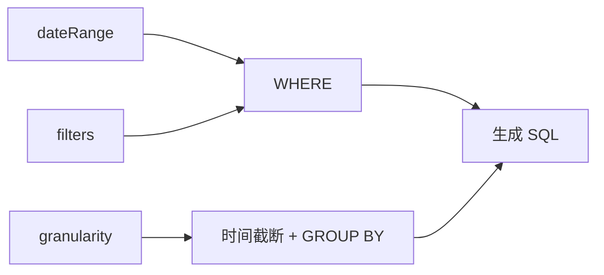

# 03：构建时间序列指标

## 学习目标

理解时间 dimension、granularity、date range、filter 和 timezone 如何共同决定时间序列结果，并能验证日/月聚合没有漏数或重复计算。

> 本章尚未实现代码；示例查询是实现目标。

## 时间维度不是普通字符串

时间 dimension 告诉 Cube 该字段可以按年、季度、月、周、日等粒度截断和分组。粒度决定输出桶，不等于过滤范围：`granularity: month` 负责按月分组，`dateRange` 负责选择哪些数据进入计算。

```json
{
  "measures": ["transactions.total_amount"],
  "timeDimensions": [{
    "dimension": "transactions.traded_at",
    "granularity": "month",
    "dateRange": ["2025-01-01", "2025-12-31"]
  }],
  "filters": [{
    "member": "transactions.side",
    "operator": "equals",
    "values": ["BUY"]
  }]
}
```

这表示“2025 年每月 BUY 成交金额”，不是“把所有交易算完后再在客户端过滤”。过滤应尽量进入语义查询，让数据库只处理需要的数据。

## 查询链路



## 金融数据中特别要注意

- 时区决定一笔跨午夜交易属于哪一天；教程默认 UTC，并明确转换边界。
- 自然日不是交易日。没有交易的日期是否补零，应由展示或专门日历模型明确处理，不能悄悄假设。
- 月度总额通常可以由日度总额求和，但日均价格等非加性指标不能简单相加。
- 日期边界必须用首日、末日和跨月样本测试。

## 实操与验证

分别执行无粒度总计、按日、按月、带 BUY 过滤和空区间查询。对固定 fixture 写数据库基准 SQL，验证月度值等于对应日度值之和，并检查响应中的时间字段格式。

## 常见误区

- 把粒度当成日期过滤条件。
- 在前端下载全部明细再聚合。
- 忽略 API、Cube 和数据库会话时区。
- 为没有数据的日期自动补零，却不披露处理规则。

## 验收标准

- 按日和按月聚合均能运行。
- 聚合结果与数据库基准查询一致。
- 空日期范围和非法粒度有明确行为。

## 下一步

第 04 章加入组合、持仓和证券实体，学习多表 Join 对指标正确性的影响。
