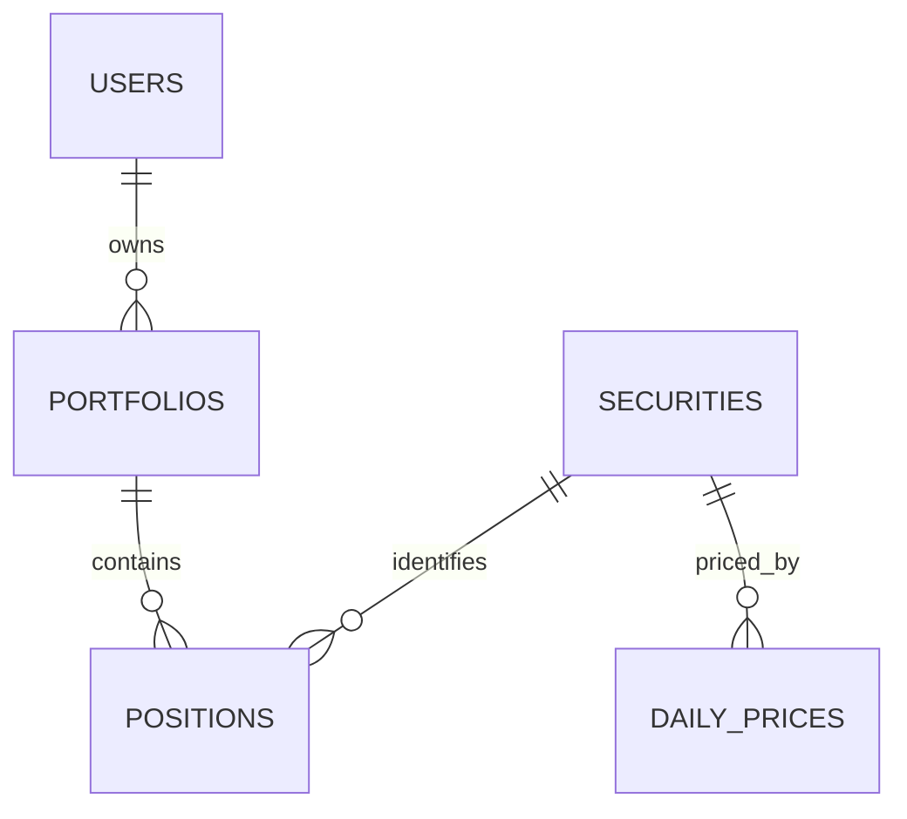

# 04：关联模型并发布组合 View

## 学习目标

连接组合、持仓、证券与价格实体，理解关系基数、fan-out 和 View，为消费者发布一套没有 Join 歧义的组合分析接口。

本章提供可运行的 `positions`、`portfolios`、`securities` Cube 和 `portfolio_holdings` View。运行时继续复用根目录 PostgreSQL、Compose 和 `.env`。

## 数据关系



一个组合有多个持仓，一个证券也可能出现在多个组合。关系声明必须与真实唯一键一致，否则查询虽然成功，金额可能因行数膨胀而被重复求和。

## Join 的核心不是语法，而是粒度

`positions` 的事实粒度可能是“组合 + 证券 + 日期”，`daily_prices` 的粒度可能是“证券 + 交易日”。若只按证券连接而遗漏日期，一条持仓会匹配多个价格，持仓市值被重复计算。学习 Join 时必须先用一句话写出每张事实表“一行代表什么”。

## Join 到底做了什么

Join 就是根据共同编号，把分散在不同表中的信息拼到同一行。持仓表只保存外键和数值：

| `portfolio_id` | `security_id` | `market_value` |
|---:|---:|---:|
| 1 | 1 | 40000 |

组合表和证券表负责解释这些编号：

| `portfolios.id` | `portfolios.name` |
|---:|---|
| 1 | Alpha Growth |

| `securities.id` | `securities.symbol` |
|---:|---|
| 1 | 510300.SH |

模型中的两个 Join：

```yaml
joins:
  - name: portfolios
    sql: "{CUBE}.portfolio_id = {portfolios.id}"
    relationship: many_to_one

  - name: securities
    sql: "{CUBE}.security_id = {securities.id}"
    relationship: many_to_one
```

概念上会生成：

```sql
FROM positions
LEFT JOIN portfolios
  ON positions.portfolio_id = portfolios.id
LEFT JOIN securities
  ON positions.security_id = securities.id
```

最终消费者看到的是：

| 组合名称 | 证券代码 | 市值 |
|---|---|---:|
| Alpha Growth | 510300.SH | 40000 |

`many_to_one` 表示“很多条持仓可以属于同一个组合，但每条持仓只能对应一个组合”。如果右侧编号不唯一，一条持仓就可能匹配多行并产生 fan-out。

## Cube 与 View 的分工

- Cube 保存表映射、指标公式和 Join 关系，是内部建模积木。
- View 选择明确的 `join_path` 和公开成员，是消费者看到的稳定门面。
- View 不应重新实现 `quantity * close` 等业务公式。

本章发布 `portfolio_holdings` View，只暴露组合名称、证券代码、资产类别、日期、数量和市值等成员，隐藏内部外键与不适合终端用户的 Cube。

## 先理解本章术语

### View 是什么

这里的 View 是 Cube 的语义 View，不是 PostgreSQL `CREATE VIEW`。它不保存新数据，而是把多个内部 Cube 中允许使用的成员整理成一个面向消费者的入口。例如使用者只看到“组合名称、证券代码、资产类别、持仓市值”，不需要理解 `portfolio_id`、`security_id` 和底层 Join。

### 公开成员是什么

公开成员就是 View 的允许列表。模型内部可以有很多主键、外键和辅助字段，但只有 `includes` 中列出的 Dimension 和 Measure 才通过这个 View 暴露。这样 Dashboard 和 Agent 的选择范围更小，也不容易误用内部字段。

### `join_path` 是什么

`join_path` 是从事实 Cube 出发到目标 Cube 的明确路径：

```text
positions                  持仓事实
positions.portfolios       持仓 → 投资组合
positions.securities       持仓 → 证券
```

例如 View 中的组合名称来自 `positions.portfolios`，证券代码来自 `positions.securities`。如果将来同一个实体存在多条连接路线，明确路径可以避免 Cube 猜错路线。

### 关系基数是什么

关系基数描述一行数据最多能匹配多少行：

- `many_to_one`：多条持仓可以属于同一个组合，但每条持仓只属于一个组合；
- `one_to_many`：一个组合可以包含多条持仓；
- Primary Key（主键）：唯一标识一行实体，帮助 Cube 判断 Join 是否可能复制事实行。

本章从 `positions` 出发，所以到 `portfolios` 和 `securities` 都是 `many_to_one`。

### fan-out 是什么

fan-out（连接后行数膨胀）是“一条事实行错误匹配多行”。例如一条持仓市值为 `40000`，如果只按证券连接 `daily_prices`，而该证券有两天价格，这条持仓就会出现两次：

持仓表原本只有一行：

| 组合 | 证券 | 持仓日期 | 市值 |
|---|---|---|---:|
| Alpha Growth | 510300.SH | 2025-01-03 | 40000 |

价格表中同一证券有两天价格：

| 证券 | 价格日期 | 收盘价 |
|---|---|---:|
| 510300.SH | 2025-01-02 | 3.95 |
| 510300.SH | 2025-01-03 | 4.00 |

错误 SQL 只连接证券：

```sql
ON positions.security_id = daily_prices.security_id
```

结果会把一条持仓复制为两行：

| 持仓日期 | 价格日期 | 市值 |
|---|---|---:|
| 2025-01-03 | 2025-01-02 | 40000 |
| 2025-01-03 | 2025-01-03 | 40000 |

此时 `SUM(market_value)` 得到错误的 `80000`。正确连接必须同时限制日期：

```sql
ON positions.security_id = daily_prices.security_id
AND positions.position_date = daily_prices.price_date
```

这样一条持仓只匹配当天的一条价格，市值仍为 `40000`。

正确做法是同时按证券和持仓日期连接价格，或者像本章一样直接使用 `positions.market_value`，不加入不需要的价格表。`distinct` 不能从根本上修复这个问题，因为两条合法持仓也可能恰好具有相同数值。

本章脚本的 fan-out guard 会把 View 返回的所有市值分组重新相加。正确总数是 `200030`；如果 Join 复制了持仓，结果会大于 `200030`，测试立即失败。

## 底层如何处理

客户端查询 View 成员后，Cube 先把 View 成员还原为各 Cube 成员，再沿 `positions.portfolios` 和 `positions.securities` 两条固定 `join_path` 建立 Join 图。`many_to_one` 告诉规划器每条持仓最多匹配一个组合和一只证券；各 Cube 的 Primary Key 则用于识别实体唯一性并避免聚合 fan-out。最后 Cube 生成带 `LEFT JOIN`、`GROUP BY` 和 `SUM(market_value)` 的 PostgreSQL SQL。

```text
View 成员 → 解析 join_path → 校验关系与主键 → 生成 JOIN/GROUP BY → PostgreSQL 聚合 → JSON
```

## 运行与验证

```bash
cd cube-demos/04-joins-and-portfolio-view
./demo.sh
python3 -m unittest test_demo.py -v
```

脚本按组合和资产类别查询市值，并断言所有分组重新相加仍为 `200030`。如果 Join 导致持仓行重复，该 fan-out guard 会立即失败。Playground 中选择 `组合持仓分析` View 的“组合名称”“资产类别”和“持仓市值”，应得到相同的 5 个分组。

## 如何发现 fan-out

先查询不 Join 时的持仓数量与总额，再逐个添加证券、价格 dimension。测试应断言添加描述性维度不会改变基础总额。还要执行底层 SQL 检查关联前后行数，而不是只凭页面看起来合理。

## 常见误区

- 把所有表连成一张巨大 Cube。
- 只声明 Join SQL，不核对 relationship 和主键。
- 让同一对实体存在多条隐式路径，消费者不知道走哪条。
- 用 `distinct` 掩盖错误 Join；它可能消除合法重复记录。

## 验收标准

- Join 关系和主键定义明确。
- 能按组合和资产类别查询持仓市值。
- 测试能发现重复 Join 导致的指标膨胀。

## 下一步

第 05 章在正确粒度上定义比率和派生指标。
