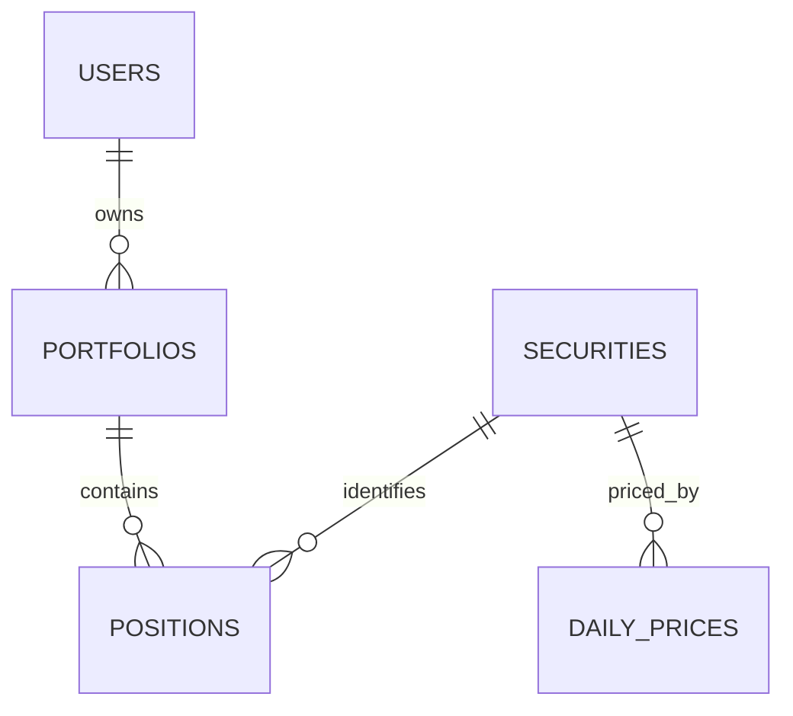

# 04：关联模型并发布组合 View

## 学习目标

连接组合、持仓、证券与价格实体，理解关系基数、fan-out 和 View，为消费者发布一套没有 Join 歧义的组合分析接口。

> 本章尚未实现代码。

## 数据关系

一个组合有多个持仓，一个证券也可能出现在多个组合。关系声明必须与真实唯一键一致，否则查询虽然成功，金额可能因行数膨胀而被重复求和。

## Join 的核心不是语法，而是粒度

`positions` 的事实粒度可能是“组合 + 证券 + 日期”，`daily_prices` 的粒度可能是“证券 + 交易日”。若只按证券连接而遗漏日期，一条持仓会匹配多个价格，持仓市值被重复计算。学习 Join 时必须先用一句话写出每张事实表“一行代表什么”。

## Cube 与 View 的分工

- Cube 保存表映射、指标公式和 Join 关系，是内部建模积木。
- View 选择明确的 `join_path` 和公开成员，是消费者看到的稳定门面。
- View 不应重新实现 `quantity * close` 等业务公式。

计划发布 `portfolio_holdings` View，只暴露组合名称、证券代码、资产类别、日期、数量和市值等成员，隐藏内部外键与不适合终端用户的 Cube。

## 如何发现 fan-out

先查询不 Join 时的持仓数量与总额，再逐个添加证券、价格 dimension。测试应断言添加描述性维度不会改变基础总额。还要执行底层 SQL 检查关联前后行数，而不是只凭页面看起来合理。

## 常见误区

- 把所有表连成一张巨大 Cube。
- 只声明 Join SQL，不核对 relationship 和主键。
- 让同一对实体存在多条隐式路径，消费者不知道走哪条。
- 用 `distinct` 掩盖错误 Join；它可能消除合法重复记录。

## 验收标准

- Join 关系和主键定义明确。
- 能按组合和资产类别查询持仓市值。
- 测试能发现重复 Join 导致的指标膨胀。

## 下一步

第 05 章在正确粒度上定义比率和派生指标。
