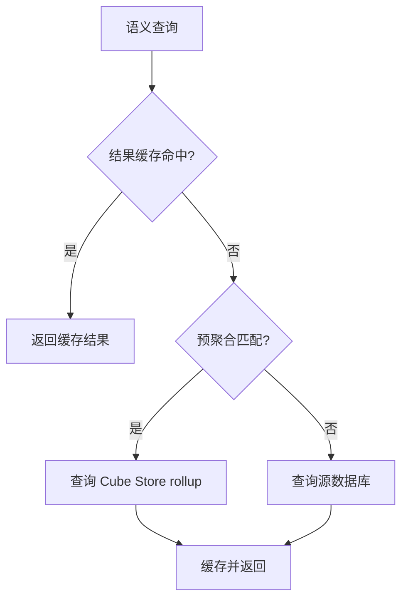

# 08：用预聚合优化查询

## 学习目标

理解结果缓存与预聚合的区别，为高频时间序列定义 rollup、刷新策略，并用执行证据验证匹配结果。

> 本章尚未实现 Cube Store 和 rollup 配置。

## 两层缓存

第一层是查询结果缓存：相同生成 SQL 且 refresh key 未变化时，可以复用完整结果。第二层是预聚合：提前保存更小的聚合数据集，不同查询只要满足匹配条件，也可能复用同一个 rollup。

“第二次查询更快”不能证明命中预聚合，它可能只是结果缓存。必须检查 Playground 的查询信息、生成 SQL或服务日志所显示的数据来源。

## Rollup 的组成

一个典型 rollup 声明可保存的 measures、dimensions、time dimension 和 granularity。目标查询所需成员、时间粒度和时区必须满足匹配规则。非加性 measure、缺失维度或时区不一致常导致回源。

## Refresh key

预聚合不是永久正确的快照。Refresh key 决定 Cube 何时判断数据版本变化并重建。基于时间间隔的刷新简单但可能延迟；基于 `MAX(updated_at)` 的 SQL 更贴近数据变化，但会增加检查查询。生产环境通常还需要独立 refresh worker，本教程不会把开发模式行为当成生产架构。

## 性能实验

1. 先运行无预聚合的基线查询并记录来源与耗时。
2. 定义按日成交金额 rollup。
3. 触发构建，验证相同结果命中 rollup。
4. 添加 rollup 未覆盖的 dimension，观察回源。
5. 修改 fixture 和 refresh key，验证新旧数据切换。

正确性断言必须先于性能断言：源查询与 rollup 查询结果逐项一致，才能比较耗时。

## 常见误区

- 为每个查询创建一个 rollup，造成构建与存储爆炸。
- 只测第二次查询时间，不检查执行来源。
- 忽略时区和非加性指标的匹配限制。
- 把 rollup-only 模式当默认配置，导致未覆盖查询直接失败。

## 验收标准

- 可以观察首次构建和后续查询行为。
- 有证据表明目标查询命中预聚合。
- 不匹配查询会回源且原因可解释。

## 下一步

第 09 章确保缓存和预聚合也不能绕过租户权限。
