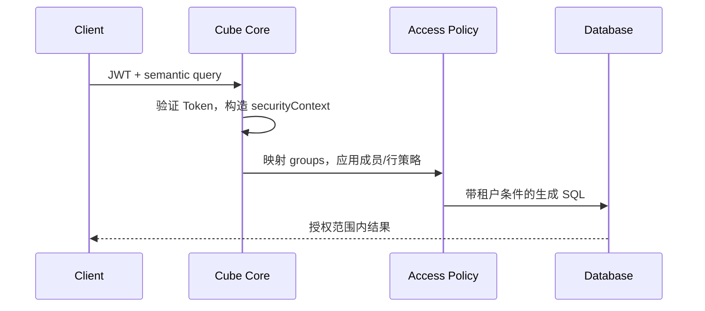

# 09：实施租户访问控制

## 学习目标

区分认证与授权，从可信 Token 生成 security context，并用访问策略实施组、成员和行级限制。

> 本章尚未实现认证代码。最终实现会使用测试密钥和本地签发 Token，不提交真实秘密。

## 认证与授权

- 认证回答“调用者是谁，Token 是否可信”。
- 授权回答“这个调用者可以查询哪些模型、成员和数据行”。

JWT 中的租户 ID 只有在签名和声明被服务端验证后才可信。绝不能让浏览器直接提交 `tenant_id` 查询参数并把它当权限依据。

## Cube Core 与 Cube Cloud 边界

本地 Cube Core 策略引用 `securityContext`，并可能通过 `context_to_groups` 把上下文映射为组。Cloud 文档中的 `userAttributes` 不能原样复制到 Core。本章只把 Core 可复现路径作为必需内容。

## 三层控制

- 模型/View 级：某组是否能查询这个数据集。
- 成员级：是否能读取敏感 dimension 或 measure。
- 行级：即便查询同一 measure，也自动限制为当前租户的数据。

策略应默认拒绝未匹配组。公开 View 比直接暴露所有内部 Cube 更容易审查。

## 必须包含的负向测试

无 Token、签名错误、Token 过期、缺少 tenant、未知 group、租户 A 请求租户 B、普通用户读取受限成员。测试不仅断言请求失败，还要保证响应和日志不泄露别的租户数据。

## 缓存安全

缓存键和预聚合查询必须保持 security context 的隔离语义。不能为了提高命中率而在应用层缓存“所有租户的查询结果”再自行过滤。

## 常见误区

- 把前端传来的角色直接当可信角色。
- 只隐藏 UI 字段，却允许 API 查询。
- 只写正向测试，没有越权测试。
- 在日志完整打印 JWT 或敏感上下文。

## 验收标准

- 两个租户只能查询各自组合。
- 普通用户不能访问受限成员。
- 缺失、伪造和越权上下文均有负向测试。

## 下一步

第 10 章让 Dashboard 在用户上下文中消费受保护的 View。
