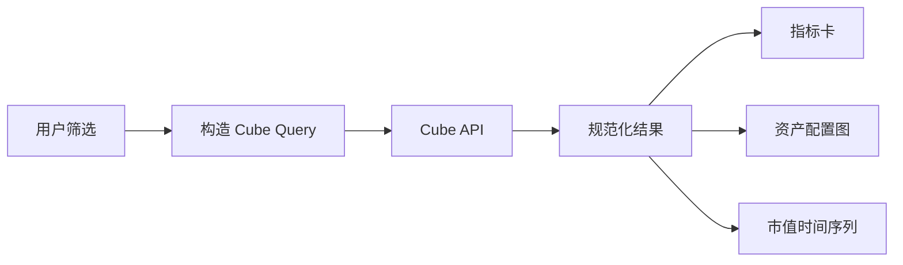

# 10：构建金融分析 Dashboard

## 学习目标

构建只负责交互与展示的 Streamlit 页面，理解筛选器、Cube Query、结果转换和图表之间的边界。

本章提供 `dashboard.py` 查询逻辑和 `app.py` Streamlit 页面。查询构造、结果转换可脱离 UI 单测。

## 页面架构



Streamlit 不连接源数据库，不知道持仓市值公式，也不自行拼 Join。它只把组合、日期和粒度等用户选择转换为已允许的语义查询。

## 页面组成

- 组合选择器：值来自当前用户可见的组合 dimension。
- 日期与粒度：影响 time dimension，而不是下载全部数据后重采样。
- 指标卡：展示总市值等聚合 measure。
- 图表：消费按资产类别或时间分组的响应。
- 诊断区：开发模式显示请求 ID 和非敏感错误，生产界面不暴露内部 SQL。

## 状态处理

页面至少有 loading、success、empty 和 error 四种状态。空结果是合法业务状态，不能显示为服务故障；权限失败也不能伪装成“没有数据”。

## 性能原则

筛选变化才触发查询；相同输入可使用短期客户端缓存，但缓存键必须包含用户/租户上下文；限制时间范围和返回行数；大数据聚合交给 Cube 与预聚合。

## 验证

用 API 自动化测试验证数据，用少量 UI smoke test 验证控件到查询的映射。核心指标不应依赖截图或肉眼判断。

## 底层如何处理

组合选择器只改变 `portfolio_holdings.portfolio_name` Filter；`build_query` 生成固定允许成员组成的查询，Cube 完成 Join 和 `SUM(market_value)`。`normalize_rows` 只把 API 字段改成展示字段，并用 `Decimal` 保留金额精度，不重新计算业务指标。页面根据 HTTP 和数据结果区分 success、empty 与 error。

```text
Streamlit 控件 → build_query → Cube REST → 语义层聚合 → normalize_rows → 指标卡/表格/图表
```

## 运行与验证

```bash
cd cube-demos/10-streamlit-dashboard
./demo.sh
python3 -m unittest test_demo.py -v

# 可选启动页面
python3 -m pip install -r requirements.txt
./demo.sh ui
```

命令行 smoke test 断言页面将消费的市值合计仍为 `200030`，因此 UI 显示不能成为指标正确性的唯一证据。

## 常见误区

- 前端再次计算收益率或持仓市值。
- 为图表读取明细后在 Pandas 聚合。
- 缓存未包含租户身份。
- 把所有异常都显示为空表。

## 验收标准

- 页面支持组合和日期筛选。
- 图表数据完全来自 Cube 的公开成员。
- 空结果和 API 失败有清晰界面状态。

## 下一步

第 11 章复用同一公开模型，让 LLM 选择查询，而不是绕开 Dashboard 直连数据库。
