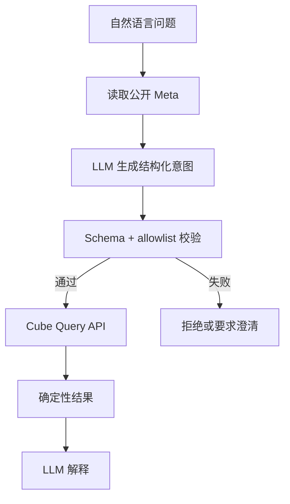

# 11：让 LLM 安全使用语义层

## 学习目标

理解语义层如何缩小 LLM 的决策空间，让模型基于公开元数据生成受约束 Cube Query，并解释由 Cube 确定性计算的结果。

> 本章尚未实现模型调用。基础路径将支持 fake/rule model 做离线测试，真实 LLM 作为可选运行方式。

## 为什么不让 LLM 直接写底层 SQL

直接面对原始表时，模型必须猜表、Join、指标公式、权限条件和数据库方言。即使 SQL 能运行，也可能采用错误口径。使用语义层后，模型只需要在已审核的 measure、dimension、filter 和时间粒度中选择。

## 模型可以做什么

- 从用户问题中选择公开指标与维度。
- 解析日期范围、排序和粒度。
- 在信息不足时提出澄清问题。
- 基于返回数据写自然语言摘要。

## 模型不能做什么

- 访问源数据库或提交任意 SQL。
- 自行新增未审核的指标公式。
- 修改或伪造 security context。
- 在工具没有返回数值时编造答案。
- 把相关性描述成确定因果关系或投资建议。

## 结构化查询契约

模型输出先进入本地 schema：成员必须存在于当前用户可见 Meta，操作符和粒度来自枚举，日期范围与 limit 有上限。校验后的对象才能发送给 Cube。只靠 prompt 写“不要越权”不构成安全边界。

## 如何处理歧义

“今年收益最好组合”至少缺少收益定义、基准、币种和今年的时区边界。模型应返回澄清问题，不能偷偷选择一个公式。明确的问题才转成查询，并在回答中披露指标名、区间和粒度。

## 测试方法

使用固定自然语言问题和 fake model 输出测试解析与校验；加入不存在成员、越权成员、超大 limit、非法过滤器和 prompt injection。数值答案与直接 Cube Query 比较，不能用 LLM 自己判断答案是否正确。

## 常见误区

- 把整个数据库 schema 塞进 prompt 就称为语义层。
- 只校验 JSON 格式，不校验成员权限。
- 让模型同时生成查询、执行查询并裁判自己是否正确。
- 把自然语言解释缓存给其他租户。

## 验收标准

- 模型只能选择允许的 measure、dimension、filter 和粒度。
- 查询执行前经过结构校验和权限检查。
- 模型不能直接访问数据库或编造数值结果。

## 下一步

第 12 章把确定性模型、权限、缓存、Dashboard 和 AI 查询放入同一条可验证链路。
