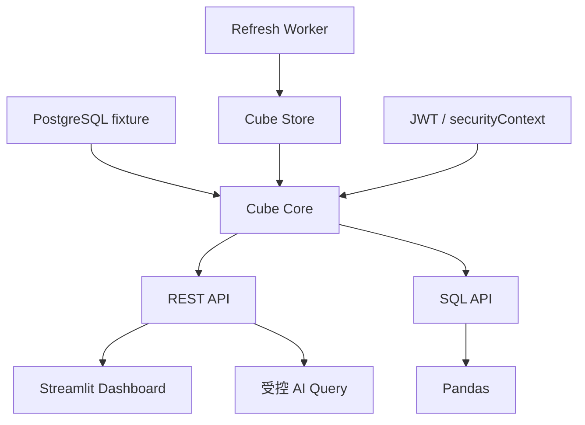

# 12：组装完整金融分析栈

## 学习目标

把前 11 章收口成一个可启动、可测试、可观察的金融分析栈，并明确教学架构与生产系统之间仍存在的距离。

本章提供统一 `demo.sh`，只组合已经逐章验证的能力，不在最后一章突然引入新框架。默认执行确定性核心链路；设置 `FULL_STACK=1` 时再加入需要额外 Python 依赖和 Cube Store 镜像的 07、08。

## 完整架构



## 一条命令启动不等于一个进程

统一入口负责检查环境、启动服务、等待健康、初始化 fixture，并运行 smoke test。数据库、Cube API、预聚合存储和应用仍保持职责分离。脚本不能用长时间固定 sleep 猜服务是否启动，而应轮询有超时的健康条件。

## 底层如何处理

统一脚本不是把所有代码合成一个进程，而是依次切换并验证明确边界：04 证明 Join/View 指标正确，06 证明 REST 客户端契约，09 证明 JWT 租户隔离，10 证明 UI 查询映射，11 证明 AI 白名单。每层失败都会保留自己的章节输出，因此可以定位是模型、API、权限还是应用问题。

```text
PostgreSQL → Cube 模型/View → REST/SQL → 权限/缓存 → Dashboard/LLM
     数据       指标口径        接口       治理          消费者
```

## 运行与验证

```bash
cd cube-demos/12-financial-analytics-stack
./demo.sh

# 包含 Pandas SQL API 和 Cube Store 预聚合
FULL_STACK=1 ./demo.sh
python3 -m unittest test_demo.py -v
```

默认路径不需要 Streamlit 或真实 LLM 服务；它验证页面和 Agent 依赖的确定性核心。完整路径需要先安装 07 的 Python 依赖，并允许首次下载 Cube Store 镜像。

## 端到端验收路径

1. 启动干净环境并加载固定数据。
2. 编译所有 Cube 与 View。
3. 以租户 A 查询 REST 指标并记录结果。
4. 通过 SQL API 查询相同指标并比较。
5. 证明目标时间序列命中预聚合。
6. 证明租户 A 无法读取租户 B 数据。
7. Dashboard 展示相同口径。
8. AI 查询经过 schema 校验并引用同一结果。

任何一步失败都应指出所属层：基础设施、模型编译、源 SQL、权限、缓存、客户端还是 LLM 编排。

## 可观察性

至少保留服务健康、请求 ID、查询耗时、缓存/预聚合来源和不含敏感信息的错误日志。指标正确性由测试保证，运行健康由观测信号保证，两者不能互相替代。

## 配置与秘密

仓库提交 `.env.example`，不提交 Token、数据库真实密码和模型 API Key。开发默认值只用于本机隔离网络；生产必须更换密钥、关闭开发模式并采用正式身份提供方。

## 教学版没有解决的问题

- 高可用、容量评估、备份恢复和跨区域部署。
- 企业身份系统、密钥轮换和完整审计。
- 大规模真实行情、公司行动、币种换算和交易日历。
- 指标版本管理、数据血缘与正式发布流程。
- LLM 评测、成本控制和合规审查。

这些应被明确记录，而不是为了让 demo 看似“生产级”而加入未经验证的复杂抽象。

## 学完后的自测

- 能否解释 Cube 与数据库、BI、dbt 的边界？
- 能否从语义查询推断生成 SQL 的聚合与 Join？
- 能否发现错误关系导致的 fan-out？
- 能否解释结果缓存与预聚合的区别？
- 能否证明租户隔离，而不只是隐藏 UI？
- 能否说明 LLM 为什么不能成为数值真值来源？

## 验收标准

- 一条命令启动完整本地栈。
- 自动化 smoke test 覆盖健康检查、指标、权限和预聚合。
- Dashboard 与 AI 查询返回相同口径的指标。
- README 明确生产化仍需补齐的认证、密钥、监控和容量设计。

## 完成标准

完成本章后，读者不仅能运行页面，还能沿查询生命周期解释每个结果从何而来、使用了什么指标口径、经过了哪些权限规则，以及是否命中预聚合。
