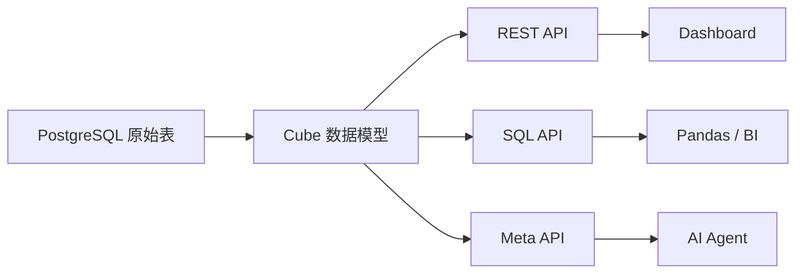
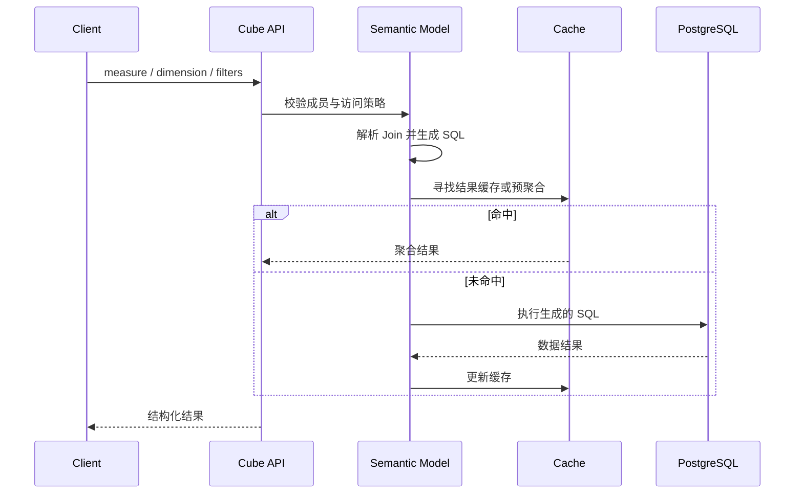

# Cube：从金融数据到可信分析应用

这是一条面向“有 SQL 和基础数据分析经验”的 Cube 学习路径。它围绕同一组金融数据，逐步完成数据源连接、语义建模、查询 API、预聚合、权限控制、Dashboard 和 AI 查询。

本系列把 Cube 当作位于数据库和消费端之间的语义层，而不是数据库、BI 工具或让 LLM 自由生成 SQL 的包装器。

```text
PostgreSQL 金融数据
  -> Cube / View / Measure / Dimension
  -> REST API / SQL API
  -> Pre-aggregation / Access Control
  -> Dashboard / AI Agent
```

## 为什么需要语义层

如果 Dashboard、Notebook 和 Agent 都直接查询数据库，它们通常会分别实现“成交金额”“持仓市值”“组合收益”等公式。相同名称可能对应不同过滤条件、Join 路径和时间口径，最终出现同一个问题得到多个答案。

Cube 把这些定义放在数据源与消费端之间：



Cube 不搬走数据库里的原始事实。它读取一个声明式查询，检查允许使用的成员和访问规则，选择 Join 路径与可用预聚合，生成底层 SQL，再把结果转换成 API 所需格式。于是“指标怎么计算”和“谁能看什么数据”只需要定义一次。

## 先理解六个核心概念

### Cube

Cube 通常映射一张表或一段 SQL，是内部业务逻辑的载体。它定义：

- dimension：用于分组、筛选或展示的属性；
- measure：对多行事实进行聚合的指标；
- join：实体之间允许采用的关联关系；
- segment：可复用的过滤条件；
- pre-aggregation：可匹配的预计算结果；
- access policy：成员和数据行的访问约束。

### Dimension

Dimension 描述一行事实的属性，例如证券代码、交易方向、组合 ID 和交易时间。它回答“按什么分组或筛选”。时间 dimension 还允许按日、周、月等粒度聚合。

### Measure

Measure 描述跨行聚合后的业务量，例如交易数、成交数量、成交金额。它回答“计算什么”。Measure 不是数据库里随便一列的别名；它必须明确聚合语义，否则 Join 后很容易重复计算。

### Join

Join 告诉 Cube 实体如何连接以及关系基数。`many_to_one`、`one_to_many` 等关系不只是文档，它们会影响 Cube 如何规划查询和避免 fan-out。错误的主键或关系声明可能生成合法 SQL，却得到错误指标。

### View

View 位于 Cube 之上，选择并重命名消费者真正需要的成员。Cube 适合作为内部建模积木，View 适合作为 Dashboard、分析师和 Agent 的公开契约。计算逻辑仍应放在 Cube，View 负责整理门面，而不是复制公式。

### Query

消费者查询语义成员，而不是指定表和 Join：

```json
{
  "measures": ["transactions.total_amount"],
  "dimensions": ["transactions.side"],
  "timeDimensions": [{
    "dimension": "transactions.traded_at",
    "granularity": "month",
    "dateRange": ["2025-01-01", "2025-12-31"]
  }]
}
```

这个请求表达“要什么”，Cube 决定“如何从数据库得到”。REST Query、Semantic SQL 和图形界面最终都依赖同一份模型定义。

## 一次查询内部发生什么



学习 Cube 时不要只观察最终 JSON。还要检查元数据、生成的 SQL、执行日志、缓存来源和 security context，才能理解结果为何正确。

## Cube 不负责什么

- Cube 不是数据仓库，不替代 PostgreSQL、Snowflake 或 BigQuery。
- Cube 不负责清洗所有原始数据；复杂数据转换通常应在数据库或 dbt 等上游完成。
- Cube 不是完整 BI 产品；Dashboard 是它的消费者之一。
- Cube 不会自动判断一个金融指标在经济含义上是否合理。
- 预聚合提高读取性能，但不会修复错误的公式、Join 或权限规则。

## 成功标准

完成本系列后，应该能够：

- 用 Cube Core 在本地连接 PostgreSQL。
- 把金融指标定义成可复用、可测试的 measure 和 dimension。
- 通过 REST API 和 SQL API 查询同一套指标。
- 用预聚合优化高频时间序列查询，并验证是否命中。
- 用访问策略隔离不同租户的投资组合数据。
- 让 Dashboard 和 AI Agent 消费语义层，而不是复制指标逻辑。

## 统一业务数据

所有章节复用同一组小型、确定性的教学数据：

| 表 | 用途 |
|---|---|
| `users` | 用户、角色和租户 |
| `securities` | 证券代码、名称和资产类别 |
| `daily_prices` | 日行情 |
| `portfolios` | 投资组合 |
| `positions` | 组合持仓 |
| `transactions` | 交易流水 |

教学数据只用于验证模型和查询语义，不代表生产数据模型，也不从网络实时下载。

## 公共运行环境

从第 02 章开始，所有章节共用 `cube-demos` 根目录下的运行环境，不在每个章节复制 Compose、`.env.example` 和数据库 fixture：

```text
cube-demos/
├── .env.example          # 公共环境变量模板
├── compose.yaml          # 公共 Cube Core 与 PostgreSQL
├── demo.sh               # 公共服务启停和就绪检查
├── data/                 # 公共数据库 schema 与 seed
├── 01-.../
│   ├── demo.sh           # 第 01 章断言
│   └── model/
└── 02-.../
    ├── demo.sh           # 第 02 章断言
    └── model/
```

章节 `demo.sh` 通过 `CUBE_MODEL_DIR` 选择本章模型，然后调用公共入口。PostgreSQL、网络、数据卷和宿主机 `4000`/`55432` 端口保持共用；切换章节时只更新 Cube 使用的模型目录。

## 学习路径

| # | 目录 | 主题 | 新增能力 | 验收标准 |
|---|---|---|---|---|
| 1 | [`01-cube-core-and-postgres`](01-cube-core-and-postgres) | Cube Core 与 PostgreSQL | 本地服务、数据源、Playground | 服务健康且能读取数据源 |
| 2 | [`02-first-financial-cube`](02-first-financial-cube) | 第一个金融 Cube | YAML、measure、dimension | 查询交易数和成交金额 |
| 3 | [`03-time-series-metrics`](03-time-series-metrics) | 时间序列指标 | time dimension、granularity、filter | 按日和按月聚合结果正确 |
| 4 | [`04-joins-and-portfolio-view`](04-joins-and-portfolio-view) | Join 与组合 View | joins、views | 从组合查询到证券和持仓市值 |
| 5 | [`05-calculated-measures`](05-calculated-measures) | 计算指标 | calculated measure、ratio | 指标结果通过固定样本断言 |
| 6 | [`06-rest-api-client`](06-rest-api-client) | REST API 客户端 | Query API、Meta API | Python 能发现并查询公开指标 |
| 7 | [`07-sql-api-and-pandas`](07-sql-api-and-pandas) | SQL API 与 Pandas | Semantic SQL、DataFrame | Pandas 能读取语义指标 |
| 8 | [`08-pre-aggregations`](08-pre-aggregations) | 预聚合 | rollup、refresh key、Cube Store | 能证明查询命中预聚合 |
| 9 | [`09-access-control`](09-access-control) | 访问控制 | security context、访问策略 | 租户数据隔离测试通过 |
| 10 | [`10-streamlit-dashboard`](10-streamlit-dashboard) | 金融 Dashboard | 筛选、图表、统一指标 | 页面展示组合市值和时间序列 |
| 11 | [`11-semantic-layer-for-llm`](11-semantic-layer-for-llm) | LLM 使用语义层 | 元数据发现、受控查询 | 模型不能绕过公开成员和权限 |
| 12 | [`12-financial-analytics-stack`](12-financial-analytics-stack) | 完整分析栈 | 模型、权限、缓存、应用 | 一条命令完成端到端验证 |

## 分期实施

### 第一阶段：确定性语义层（01-06）

先跑通 Cube Core、PostgreSQL、金融数据模型和 REST API。阶段验收是同一个指标在固定数据上始终返回相同结果。

### 第二阶段：性能、治理与应用（07-10）

加入 SQL API、Pandas、预聚合、租户隔离和 Dashboard。阶段验收是查询路径可观察、权限有负向测试、前端不重复实现指标。

### 第三阶段：AI 与端到端集成（11-12）

LLM 只负责理解问题、选择公开成员和组织受约束查询。数值计算、权限判断和查询执行继续由 Cube 与数据库完成。

## 实施约束

- 优先使用 Cube Core 可在本地复现的能力；仅限 Cube Cloud 的能力必须明确标记，不能成为基础章节的必需条件。
- 数据模型优先使用 YAML，除非某项能力确实需要 JavaScript 或 Python 配置。
- 所有章节共享数据库 fixture 和基础运行环境，不复制十二套基础设施。
- 每章只增加一个主要概念，并提供成功路径与至少一个失败路径。
- 不把实时行情下载、复杂收益归因或 LLM 自由生成底层 SQL塞进基础系列。
- 镜像和依赖使用明确版本；升级版本单独验证，不使用不可复现的隐式最新版本。

## 每章 README 模板

每个章节实现时统一补齐：

1. 学习目标与非目标。
2. 在总链路中的位置。
3. 数据模型或查询流程图。
4. 配置和代码逐段拆解。
5. 运行命令与预期输出。
6. 自动化验证。
7. 常见坑和下一步。

## 官方资料

实现代码时以固定版本的官方文档为准：

- [Cube.js GitHub 仓库](https://github.com/cube-js/cube)
- [Cube Introduction](https://docs.cube.dev/docs/introduction)
- [Data Modeling](https://docs.cube.dev/docs/data-modeling/overview)
- [Cubes](https://docs.cube.dev/docs/data-modeling/cubes)
- [Views](https://docs.cube.dev/docs/data-modeling/views)
- [Core Data APIs](https://docs.cube.dev/reference/core-data-apis)
- [Pre-aggregations](https://docs.cube.dev/docs/pre-aggregations/index)
- [Access Control](https://docs.cube.dev/docs/data-modeling/access-control/index)

文档中的 Cube Cloud 截图或 `userAttributes` 示例不能自动视为 Cube Core 可用；每项能力都要在本地固定版本中验证。

## 实施顺序

`01-cube-core-and-postgres` 已确认容器运行时、Cube Core 镜像和 PostgreSQL 连接方式；公共环境现已提取到 `cube-demos` 根目录。后续章节只增加本章模型、查询和断言，不再复制基础设施。
