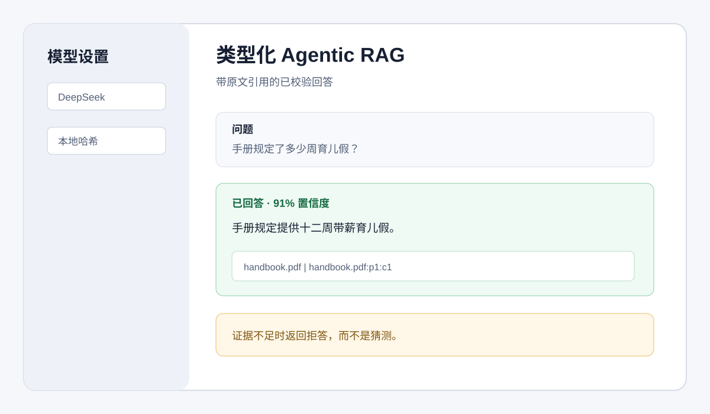

# 使用 Pydantic AI 构建类型化 Agentic RAG

这个 Streamlit 应用可以基于上传的 PDF 或文档 URL 回答问题。每次回答都会被校验为一个 `Answer` 对象，包含精确原文引用、分块 ID、置信度和 `answered` 判断。如果检索证据不足，应用会在调用语言模型前直接拒答。



## 功能

- 使用 Pydantic AI `Agent`、`RunContext` 和依赖注入。
- 提供类型化 `retrieve` 工具，返回来源元数据和余弦相似度。
- 用 Pydantic models 定义回答、引用和检索证据。
- 模型输出后继续检查引用是否真的来自已索引分块。
- 对资料库外问题使用确定性拒答门禁。
- 使用 DeepSeek 作为回答模型，和本仓库前面项目保持一致。
- 使用本地哈希 Embeddings，避免额外要求其他模型服务 key。
- 使用会话级 NumPy 内存向量库，不依赖数据库服务。

## 工作方式

1. `rag.py` 从 PDF 或网页中抽取文本，切成带重叠的分块，生成 embeddings，并把归一化向量存入内存。
2. `agent.py` 通过 `RagDependencies` 注入向量库。Pydantic AI Agent 必须先调用类型化 `retrieve` 工具，才能生成 `Answer`。
3. 预检索会把最高余弦分数和拒答阈值比较。分数太低时，直接返回 `answered=False`，不发起 LLM 请求。
4. 对于已回答结果，每个 citation 都必须匹配已存储的 source、chunk ID 和原文引用片段。引用无效或缺失时，结果会被改为拒答。
5. `app.py` 负责渲染答案、置信度、引用依据或拒答状态。

本 demo 的回答模型使用 Pydantic AI 的 DeepSeek provider，默认模型字符串是 `deepseek:deepseek-chat`。检索向量使用本地哈希后端，适合关键词导向的教学 demo；这样只需要配置 DeepSeek key。

## 前置条件

- Python 3.12 或更新版本。
- 一个 DeepSeek API key。

## 安装

从仓库根目录运行：

```bash
cd finance-llm-agent-demos/11-agentic_typed_rag_pydanticai
python3 -m venv .venv
source .venv/bin/activate
pip install -r requirements.txt
cp .env.example .env
```

在 `.env` 中添加 DeepSeek 配置：

```text
DEEPSEEK_API_KEY=你的DeepSeek API Key
DEEPSEEK_BASE_URL=https://api.deepseek.com
DEEPSEEK_MODEL_ID=deepseek-chat
```

默认回答模型是 `deepseek:deepseek-chat`。你可以在侧边栏修改模型字段，也可以设置 `RAG_MODEL` 为其他 Pydantic AI 模型字符串。

## 运行

从 `finance-llm-agent-demos/11-agentic_typed_rag_pydanticai` 运行：

```bash
streamlit run app.py
```

上传一个或多个 PDF，也可以额外填写文档 URL，然后点击 **构建知识库**。先问一个资料内问题，观察带引用回答；再问一个无关问题，观察拒答状态。

## 测试

确定性测试套件使用 Pydantic AI 的 `TestModel`，不会请求真实模型提供方：

```bash
python3 test_typed_rag.py
```

## 文件

```text
11-agentic_typed_rag_pydanticai/
├── app.py
├── agent.py
├── rag.py
├── test_typed_rag.py
├── requirements.txt
├── .env.example
└── assets/screenshot-placeholder.svg
```

本示例作为 `finance-llm-agent-demos` 的一部分，遵循 Apache-2.0 许可。
