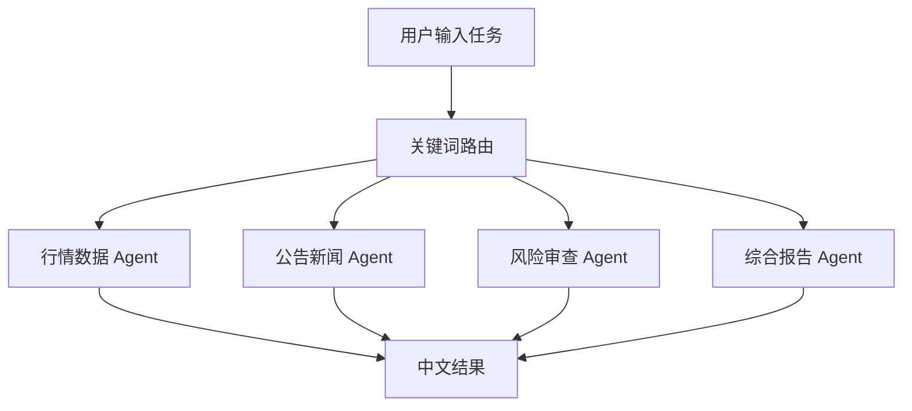

# 15 金融工具路由 Agent

这是一个金融任务路由示例。用户输入一段自然语言任务后，程序先做轻量级关键词分类，再选择对应的 Agent 和工具：

- 行情数据：使用 `YFinanceTools` 获取股票价格、公司信息和公司新闻
- 公告新闻：使用 `DuckDuckGoTools` 搜索公开新闻、公告和市场事件
- 风险审查：使用 `DuckDuckGoTools` 搜索市场、财务、监管、竞争和执行风险
- 综合报告：同时使用行情工具和新闻搜索，生成带风险提示的中文报告

本项目使用远端 DeepSeek，不使用 Ollama，也不需要本地模型容器。

## 目录结构

```text
15-finance_mcp_agent_router/
├── app.py           # Streamlit 页面、路由逻辑和四类 Agent
├── requirements.txt # Python 依赖
└── README.md        # 使用说明
```

## 安装

推荐使用 Python 3.11：

```bash
cd finance-llm-agent-demos/15-finance_mcp_agent_router
python3.11 -m pip install -r requirements.txt
```

## 配置 DeepSeek

在项目目录、`finance-llm-agent-demos` 目录或仓库根目录创建 `.env`：

```env
DEEPSEEK_API_KEY=你的DeepSeek API Key
DEEPSEEK_BASE_URL=https://api.deepseek.com
DEEPSEEK_MODEL_ID=deepseek-chat
```

程序会依次加载这三个位置的 `.env`，模型默认配置为：

```text
模型：deepseek-chat
地址：https://api.deepseek.com
```

不要把真实 API Key 写入 Git 跟踪文件。

## 启动

从仓库根目录运行：

```bash
./finance-llm-agent-demos/scripts/run_15_agent.sh
```

默认访问地址：`http://127.0.0.1:8501`。

如果 8501 已被其他项目占用，可以指定端口：

```bash
PORT=8502 ./finance-llm-agent-demos/scripts/run_15_agent.sh
```

也可以在项目目录直接运行：

```bash
cd finance-llm-agent-demos/15-finance_mcp_agent_router
python3.11 -m streamlit run app.py
```

## 使用示例

### 行情数据

```text
请分析 NVDA 的当前股价、公司信息和估值情况。
```

路由结果：`行情数据`。

### 公告新闻

```text
找出最近影响 TSLA 股价的监管和市场事件。
```

路由结果：`公告新闻`。

### 风险审查

```text
请做一份 AAPL 的主要风险审查报告。
```

路由结果：`风险审查`。

### 综合报告

```text
请分析 MSFT 的当前行情、最新新闻和主要风险，并给出中文报告。
```

路由结果：`综合报告`。

## 运行流程



1. Streamlit 收集用户任务。
2. `route_task()` 将任务转成小写文本并检查关键词。
3. 程序选择对应 Agent。
4. Agent 使用 YFinance 或 DuckDuckGo 工具获取信息。
5. DeepSeek 整理工具结果并生成中文回答。

## 路由规则

当前是可读、可修改的关键词路由，不是另一个 LLM 分类器：

| 关键词示例 | 路由 |
| --- | --- |
| `price`、`stock`、`股价`、`行情`、`估值`、`PE`、`市值` | 行情数据 |
| `news`、`公告`、`新闻`、`监管`、`事件`、`发布` | 公告新闻 |
| `risk`、`风险`、`下跌`、`不确定`、`护城河` | 风险审查 |
| 未匹配以上关键词 | 综合报告 |

如果一条任务同时包含多个类别，当前优先级是：行情数据、公告新闻、风险审查，最后才是综合报告。需要改变优先级时，直接调整 `route_task()` 中的判断顺序。

## 常见问题

### 未找到 `DEEPSEEK_API_KEY`

确认 `.env` 文件存在，并且变量名和值格式正确：

```env
DEEPSEEK_API_KEY=你的Key
```

### 新闻搜索没有结果

`DuckDuckGoTools` 依赖外部网络。检查网络连接，并尝试使用更明确的公司名称、股票代码和时间范围。

### 行情工具报错

`YFinanceTools` 依赖 Yahoo Finance 的公开数据接口，部分市场或时间段可能暂时不可用。工具返回缺失数据时，Agent 应说明缺失，不应自行编造数值。

## 安全和使用边界

- API Key 只放在环境变量或未跟踪的 `.env` 文件中。
- 新闻和行情数据可能有延迟或缺失，不能作为唯一投资依据。
- 本项目只用于 Agent、工具调用和路由机制学习，不构成投资建议。
