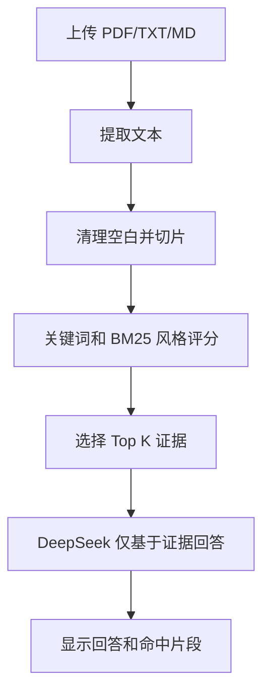

# 16 本地混合金融 RAG

这个项目演示一个不依赖向量数据库和本地大模型的金融文档 RAG：

1. 上传财报、公告、研报或普通文本。
2. 在本地解析文本并切成有重叠的片段。
3. 使用关键词和轻量 BM25 风格评分选择相关片段。
4. 只把命中的片段发送给远端 DeepSeek。
5. 要求 DeepSeek 基于证据回答，并标出片段编号和不确定性。

本项目使用远端 DeepSeek，不使用 Ollama，也不需要 Podman 或本地模型。

## 适合学习什么

- 为什么 RAG 要先检索，再生成。
- 文档切片大小和重叠范围如何影响上下文。
- 如何用本地词频和逆文档频率做低成本检索。
- 如何把证据片段编号传给模型，生成可追溯回答。
- 如何在证据不足时拒绝编造答案。

## 文件结构

```text
16-local_hybrid_financial_rag/
├── app.py           # Streamlit 页面、切片、检索和 DeepSeek 调用
├── requirements.txt # Python 依赖
└── README.md        # 使用说明
```

## 安装

```bash
cd finance-llm-agent-demos/16-local_hybrid_financial_rag
python3.11 -m pip install -r requirements.txt
```

支持的输入格式：

- `.pdf`：使用 `pypdf` 提取文本
- `.txt`：按 UTF-8 读取，无法解码的字符会被忽略
- `.md`：按普通文本读取

扫描型 PDF 如果没有文本层，`pypdf` 可能提取不到内容，需要先 OCR。

## 配置 DeepSeek

在项目目录、`finance-llm-agent-demos` 目录或仓库根目录创建 `.env`：

```env
DEEPSEEK_API_KEY=你的DeepSeek API Key
DEEPSEEK_BASE_URL=https://api.deepseek.com
DEEPSEEK_MODEL_ID=deepseek-chat
```

代码会按以下顺序加载 `.env`：

1. 当前项目目录
2. `finance-llm-agent-demos/.env`
3. 仓库根目录 `.env`

API Key 只从 `DEEPSEEK_API_KEY` 读取，不要提交真实 Key。

## 启动

从仓库根目录启动：

```bash
./finance-llm-agent-demos/scripts/run_16_agent.sh
```

默认地址：`http://127.0.0.1:8501`。

如果端口被占用：

```bash
PORT=8502 ./finance-llm-agent-demos/scripts/run_16_agent.sh
```

也可以直接运行：

```bash
cd finance-llm-agent-demos/16-local_hybrid_financial_rag
python3.11 -m streamlit run app.py
```

## 使用示例

上传一份财报或公告，在问题框中输入：

```text
这份文档中最重要的经营风险是什么？请引用证据。
```

```text
公司收入增长的主要驱动因素是什么？请列出相关片段编号。
```

```text
文档中是否提到流动性风险、债务压力或监管风险？如果没有明确证据，请说明。
```

回答下方会显示命中的片段和检索分数，便于检查模型是否引用了正确证据。

## 处理流程



### 文本切片

默认每个片段约 900 个字符，相邻片段重叠 160 个字符。重叠区域可以减少一个句子刚好位于片段边界时的信息丢失。

### 本地检索

`score_chunks()` 会统计查询词在每个片段中的出现次数，并结合类似 IDF 的权重计算分数。这个实现易读、无额外服务依赖，但不理解同义词，也不能像向量检索一样处理语义相近但词面不同的表达。

### 证据约束生成

检索片段会被编号为 `[片段 0]`、`[片段 1]` 等，提示词要求 DeepSeek：

- 只能使用给定片段回答
- 结论要引用片段编号
- 证据不足时明确说明
- 不用片段外知识补充事实

## 常见问题

### 没有找到证据片段

当前检索主要依赖词面匹配。可以尝试使用文档中的原词、公司名称、指标名称或更短的问题，例如把“经营层面的不确定性”改成“经营风险”。

### PDF 解析为空

常见原因是 PDF 只有图片没有文本层。请使用 OCR 生成可复制文本的 PDF，或先导出为 TXT/Markdown。

### API 请求失败

确认 `DEEPSEEK_API_KEY` 有效，并检查 `DEEPSEEK_BASE_URL` 是否为：

```text
https://api.deepseek.com
```

## 安全和使用边界

- 不要上传包含未脱敏个人信息、账户信息或内部机密的文档。
- API Key 只放在环境变量或未跟踪的 `.env` 中。
- RAG 回答的可靠性取决于文档内容和检索质量。
- 本项目仅用于技术学习和原型验证，不构成投资建议。
