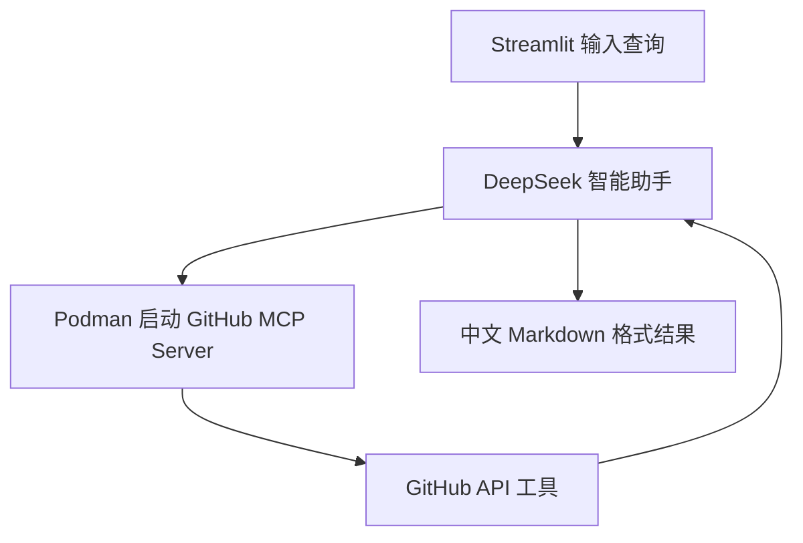

# 17 GitHub MCP 智能助手

这是一个通过 GitHub 官方 MCP 服务查询 GitHub 仓库的 Streamlit 示例。用户用自然语言描述任务，DeepSeek 智能助手负责理解意图，并通过 MCP 工具访问仓库、问题单、代码合并请求和活动信息。

本项目使用远端 DeepSeek 和 Podman，不使用 OpenAI API，也不使用 Docker 或 Ollama。

## 能做什么

- 查询仓库基本信息和健康指标
- 查看问题单、标签和讨论情况
- 查看代码合并请求、评审和合并记录
- 分析仓库活动趋势
- 根据自定义问题调用 GitHub MCP 工具
- 用中文整理结果，并尽量附 GitHub 链接

## 文件结构

```text
17-github_mcp_agent/
├── github_agent.py  # Streamlit、DeepSeek 智能助手和 MCP 调用
├── requirements.txt # Python 依赖
└── README.md        # 使用说明
```

## 运行前提

- Python 3.11 或更高版本
- Podman Desktop 或 Podman CLI
- 已启动并可连接的 Podman machine
- GitHub 个人访问令牌
- DeepSeek API Key
- 可访问 `ghcr.io` 的网络环境

检查 Podman：

```bash
podman --version
podman machine list
podman ps
```

## 安装依赖

```bash
cd finance-llm-agent-demos/17-github_mcp_agent
python3.11 -m pip install -r requirements.txt
```

## 配置密钥

推荐在项目目录、`finance-llm-agent-demos` 目录或仓库根目录创建未跟踪的 `.env`：

```env
DEEPSEEK_API_KEY=你的DeepSeek API Key
DEEPSEEK_BASE_URL=https://api.deepseek.com
DEEPSEEK_MODEL_ID=deepseek-chat
GITHUB_TOKEN=你的GitHub Personal Access Token
```

程序会自动加载上述三个位置的 `.env`。也可以直接在 Streamlit 左侧输入两个密钥，但不建议在共享屏幕或截图中展示。

GitHub Token 权限应遵循最小权限原则：

- 只读公开仓库时，优先使用不带额外写权限的 Token
- 查询私有仓库时才授予对应的私有仓库读取权限
- 不要把 Token 写入代码、README 或提交记录

## 启动

从仓库根目录执行：

```bash
./finance-llm-agent-demos/scripts/run_17_agent.sh
```

默认地址：`http://127.0.0.1:8501`。

如果端口被占用：

```bash
PORT=8502 ./finance-llm-agent-demos/scripts/run_17_agent.sh
```

也可以直接启动：

```bash
cd finance-llm-agent-demos/17-github_mcp_agent
python3.11 -m streamlit run github_agent.py
```

## 第一次运行发生什么

点击“执行查询”后，程序会：

1. 检查 DeepSeek API 密钥和 GitHub 访问令牌。
2. 启动 `ghcr.io/github/github-mcp-server` Podman 临时容器。
3. 将 GitHub Token 通过容器环境变量传给 MCP Server。
4. 让 DeepSeek 智能助手发现并调用 GitHub MCP 工具。
5. 将工具结果整理为中文 Markdown 格式。
6. 查询完成后自动删除临时容器。

容器使用 `--rm`，不会在本地保留 GitHub MCP Server 容器，但镜像会保留在 Podman 存储中。

## 示例查询

### 问题单

```text
查看 Shubhamsaboo/awesome-llm-apps 中带 bug 标签的问题单，并总结当前讨论重点。
```

### 代码合并请求

```text
查看 Shubhamsaboo/awesome-llm-apps 最近合并的代码合并请求，并列出标题和链接。
```

### 仓库活动

```text
分析 Shubhamsaboo/awesome-llm-apps 最近的仓库活动，指出活跃方向。
```

### 自定义任务

```text
检查这个仓库最近是否有与 MCP、DeepSeek 或浏览器智能助手相关的问题单和合并请求。
```

## 工作流程



## 常见问题

### Podman 未连接

确认 machine 已启动：

```bash
podman machine list
podman machine start podman-machine-default
podman ps
```

如果 machine 处于 `Currently starting` 且长时间没有 `Last Up`，先处理 Podman machine 本身，不要重复启动多个 `podman machine start`。

### 无法拉取 GitHub MCP Server 镜像

先手动测试：

```bash
podman pull ghcr.io/github/github-mcp-server
```

如果访问 `ghcr.io` 超时，请检查网络和镜像仓库设置。该项目需要使用官方 GitHub MCP Server 镜像，不会改用本地模型容器。

### GitHub Token 无权限

确认 Token 尚未过期，并且对目标私有仓库具备读取权限。公开仓库查询也建议使用受限的只读 Token，以降低泄露风险。

### 查询超时

GitHub MCP Server 首次启动需要拉取镜像，网络较慢时可能超过等待时间。先单独执行 `podman pull`，确认镜像已经在本地，再重试查询。

## 安全边界

- GitHub 访问令牌和 DeepSeek API 密钥只能放在环境变量或未跟踪的 `.env` 文件中。
- 不要让智能助手执行没有审查的写操作；本示例的 MCP 工具集只启用 `repos,issues,pull_requests`。
- 返回内容来自 GitHub API，可能受权限、速率限制和数据延迟影响。
- 本项目仅用于技术学习和原型验证。
