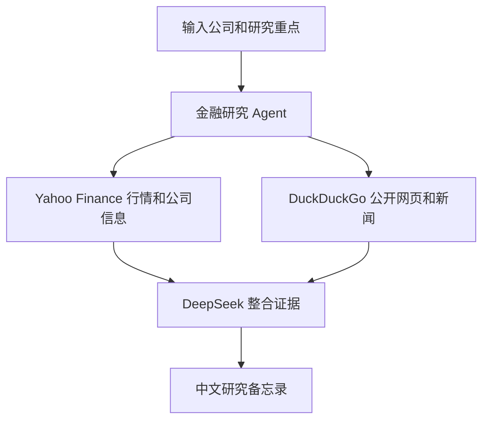

# 18 金融研究工作台

这是一个面向投研学习的 Streamlit 工作台。输入股票代码或公司名称，以及本次研究重点，Agent 会结合：

- Yahoo Finance：价格、公司基本信息和公司新闻
- DuckDuckGo：公开网页、新闻和行业信息
- DeepSeek：整理证据并生成中文研究备忘录

本项目使用远端 DeepSeek，不使用 Ollama、Docker 或 Podman。

## 输出内容

每次研究要求模型按以下结构输出：

1. 核心结论
2. 关键事实
3. 行情和公司数据表
4. 主要风险
5. 待核验问题
6. 下一步研究建议

模型还会提示结果不构成投资建议。数据缺失时应明确说明，不应自行编造数值。

## 文件结构

```text
18-financial_research_workspace/
├── app.py           # Streamlit 页面和金融研究 Agent
├── requirements.txt # Python 依赖
└── README.md        # 使用说明
```

## 安装依赖

```bash
cd finance-llm-agent-demos/18-financial_research_workspace
python3.11 -m pip install -r requirements.txt
```

## 配置 DeepSeek

在项目目录、`finance-llm-agent-demos` 目录或仓库根目录创建未跟踪的 `.env`：

```env
DEEPSEEK_API_KEY=你的DeepSeek API Key
DEEPSEEK_BASE_URL=https://api.deepseek.com
DEEPSEEK_MODEL_ID=deepseek-chat
```

程序会按以下顺序加载 `.env`：

1. 当前项目目录
2. `finance-llm-agent-demos/.env`
3. 仓库根目录 `.env`

不要把真实 API Key 写入代码或提交记录。

## 启动

从仓库根目录启动：

```bash
./finance-llm-agent-demos/scripts/run_18_agent.sh
```

默认地址：`http://127.0.0.1:8501`。

如果端口被占用：

```bash
PORT=8502 ./finance-llm-agent-demos/scripts/run_18_agent.sh
```

也可以直接启动：

```bash
cd finance-llm-agent-demos/18-financial_research_workspace
python3.11 -m streamlit run app.py
```

## 使用示例

研究对象：

```text
NVDA, MSFT
```

研究重点：

```text
增长驱动、估值风险、AI 资本开支和未来 12 个月风险。
```

其他可用问题：

```text
比较 AAPL 和 MSFT 的盈利驱动、竞争优势和主要下行风险。
```

```text
研究 TSLA 最近的交付、监管、竞争和估值风险，并列出需要继续核验的数据。
```

## 工作流程



1. 页面收集研究对象和关注重点。
2. 创建带有行情和网页搜索工具的 Agent。
3. Agent 根据任务决定需要调用哪些工具。
4. DeepSeek 汇总工具返回的数据，生成结构化备忘录。

## 数据和可靠性说明

- Yahoo Finance 数据可能延迟、缺失或暂时不可用。
- DuckDuckGo 搜索结果受网络、索引和关键词影响。
- 多家公司比较时，建议使用明确的股票代码，避免同名公司造成歧义。
- 研究报告中的数字和新闻应回到原始页面或公告进一步核验。

## 常见问题

### 未找到 `DEEPSEEK_API_KEY`

确认 `.env` 文件位于上述三个位置之一，并使用准确的变量名：

```env
DEEPSEEK_API_KEY=你的Key
```

### 网络工具没有结果

检查网络连接和数据源是否可访问。

### 生成结果超时

金融研究可能同时调用行情和搜索工具。可以先减少研究对象数量，缩小研究重点，并重试。

### 结果出现缺失数据

这是预期情况之一。程序要求模型标注缺失信息，不应为了完整性补造数据。请根据报告中的待核验问题继续查阅公司公告、监管文件和原始新闻。

## 安全边界

- 不要上传或写入包含未脱敏个人信息、账户信息或内部机密的内容。
- API Key 只放在环境变量或未跟踪的 `.env` 文件中。
- 本项目仅用于技术学习和原型验证，不构成投资建议。
