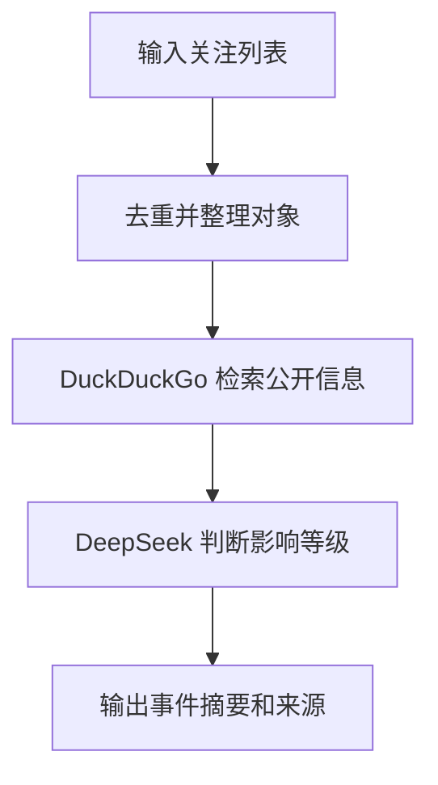

# 19 市场事件雷达 Agent

这是一个面向投研学习的市场事件监控示例。输入关注的股票代码、公司名称或主题后，Agent 使用 DuckDuckGo 检索公开信息，再由 DeepSeek 整理成事件摘要。

本项目使用远端 DeepSeek 和公开网页搜索，不使用 Ollama、Docker 或 Podman。

## 监控内容

Agent 会重点检索以下类型的事件：

- 公司公告和财报
- 监管和诉讼
- 产品发布和业务变化
- 融资、并购和评级变化
- 可能影响市场预期的重大新闻

输出要求包括影响等级、事件原因、时间信息和来源链接。程序默认只生成摘要，不发送邮件、Webhook 或其他通知。

## 文件结构

```text
19-market_event_radar_agent/
├── app.py           # Streamlit 页面和市场事件 Agent
├── requirements.txt # Python 依赖
└── README.md        # 使用说明
```

## 安装依赖

```bash
cd finance-llm-agent-demos/19-market_event_radar_agent
python3.11 -m pip install -r requirements.txt
```

## 配置 DeepSeek

在项目目录、`finance-llm-agent-demos` 目录或仓库根目录创建未跟踪的 `.env`：

```env
DEEPSEEK_API_KEY=你的DeepSeek API Key
DEEPSEEK_BASE_URL=https://api.deepseek.com
DEEPSEEK_MODEL_ID=deepseek-chat
```

程序会按以下顺序加载 `.env`：

1. 当前项目目录
2. `finance-llm-agent-demos/.env`
3. 仓库根目录 `.env`

不要把真实 API Key 写入代码、README 或提交记录。

## 启动

从仓库根目录执行：

```bash
./finance-llm-agent-demos/scripts/run_19_agent.sh
```

默认地址：`http://127.0.0.1:8501`。

如果端口被占用：

```bash
PORT=8502 ./finance-llm-agent-demos/scripts/run_19_agent.sh
```

也可以直接启动：

```bash
cd finance-llm-agent-demos/19-market_event_radar_agent
python3.11 -m streamlit run app.py
```

## 使用示例

关注列表可以每行填写一个股票代码、公司名称或主题：

```text
AAPL
MSFT
NVDA
TSLA
```

时间范围可以选择：

- 最近 24 小时：适合快速查看突发事件
- 最近 7 天：适合日常跟踪
- 最近 30 天：适合阶段性复盘

点击“生成事件摘要”后，页面会显示 DeepSeek 生成的中文事件雷达结果。

## 工作流程



1. 页面读取关注列表并按行拆分。
2. 去掉空行和重复对象，减少重复检索。
3. Agent 使用公开网页搜索获取事件信息。
4. DeepSeek 按高、中、低影响等级整理结果。
5. 页面展示摘要，默认不执行任何外部通知动作。

## 事件摘要建议格式

为了方便阅读，输入任务中可以要求模型按下面的结构输出：

```text
请按“对象、事件时间、事件类型、影响等级、事件摘要、可能影响、来源链接、待核验问题”的表格输出。
```

事件雷达适合做信息初筛，不应替代对公司公告、监管文件和原始新闻的人工核验。

## 常见问题

### 未找到 `DEEPSEEK_API_KEY`

确认 `.env` 文件位于上述三个位置之一，并检查变量名：

```env
DEEPSEEK_API_KEY=你的Key
```

### 搜索结果为空或不准确

使用股票代码和公司全名，减少含义不明确的简称。对监管、产品或行业主题，建议同时填写公司名称和主题关键词。

### 事件重复

不同新闻网站可能报道同一事件。要求模型按“事件核心事实”合并重复报道，并保留多个来源链接进行交叉验证。

### 结果生成超时

关注对象过多会增加搜索和模型整理时间。建议先从 3 到 5 个对象开始，确认结果后再扩大列表。

## 安全和使用边界

- API Key 只放在环境变量或未跟踪的 `.env` 文件中。
- 搜索结果可能有延迟、遗漏、重复或来源质量差异。
- 任何交易决策前都应核验原始公告、监管文件和公司披露。
- 本项目仅用于技术学习和原型验证，不构成投资建议。
