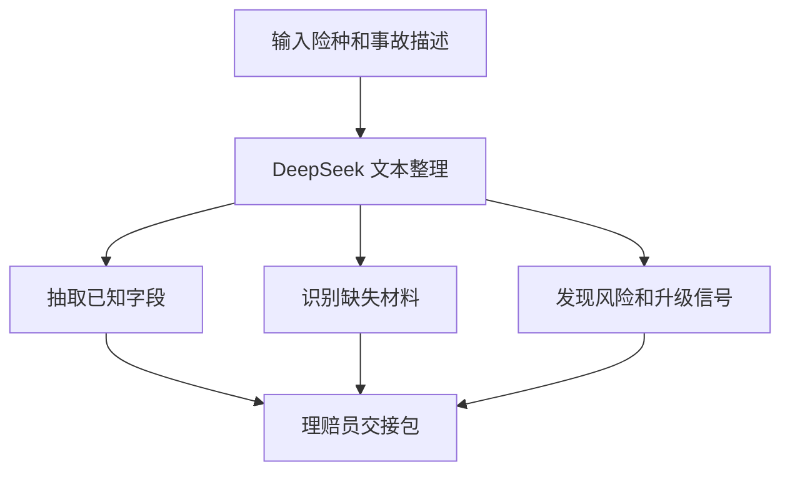

# 20 保险理赔文本智能助手团队

这是一个纯文本保险理赔 intake 示例。输入事故或损失描述后，DeepSeek 会把非结构化文字整理成理赔员交接包，帮助人工快速了解案件状态。

本项目只处理文本，不做实时语音、不连接保险核心系统、不自动提交理赔，也不做最终赔付决定。

## 输出内容

每次生成的交接包包含：

1. 已抽取字段表
2. 缺失信息
3. 需要补充的证据材料
4. 风险或人工升级信号
5. 下一步沟通话术
6. 不承诺赔付的免责声明

## 文件结构

```text
20-insurance_claim_text_agent_team/
├── app.py           # Streamlit 页面和 DeepSeek 调用
├── requirements.txt # Python 依赖
└── README.md        # 使用说明
```

## 安装依赖

```bash
cd finance-llm-agent-demos/20-insurance_claim_text_agent_team
python3.11 -m pip install -r requirements.txt
```

## 配置 DeepSeek

在项目目录、`finance-llm-agent-demos` 目录或仓库根目录创建未跟踪的 `.env`：

```env
DEEPSEEK_API_KEY=你的DeepSeek API Key
DEEPSEEK_BASE_URL=https://api.deepseek.com
DEEPSEEK_MODEL_ID=deepseek-chat
```

代码会按以下顺序加载 `.env`：

1. 当前项目目录
2. `finance-llm-agent-demos/.env`
3. 仓库根目录 `.env`

不要把真实 API Key、保单号、姓名、电话、地址或证件信息写入 Git。

## 启动

从仓库根目录启动：

```bash
./finance-llm-agent-demos/scripts/run_20_agent.sh
```

默认地址：`http://127.0.0.1:8501`。

如果端口被占用：

```bash
PORT=8502 ./finance-llm-agent-demos/scripts/run_20_agent.sh
```

也可以直接启动：

```bash
cd finance-llm-agent-demos/20-insurance_claim_text_agent_team
python3.11 -m streamlit run app.py
```

## 使用示例

险种：

```text
家庭财产保险
```

事故或损失描述：

```text
昨晚暴雨后地下室进水，地板和部分家具受损，已经拍照，暂未联系维修。
```

其他示例：

```text
车辆在停车场被追尾，前保险杠和右侧车门有明显凹陷，已拍摄现场照片，但还没有报警或定损。
```

```text
商铺冷藏设备故障，导致部分库存变质，已经保存维修记录和库存清单。
```

## 工作流程



1. 页面收集险种和事故描述。
2. 提示词要求模型按固定交接结构输出。
3. 模型区分已知事实、缺失信息和需要人工核验的内容。
4. 页面展示交接包，供人工继续处理。

## 脱敏要求

提交给模型前请删除或替换：

- 姓名、手机号、邮箱和详细地址
- 身份证、驾驶证、银行卡和保单号码
- 医疗记录、照片中的人脸和其他敏感信息
- 与案件无关的个人或第三方信息

可以使用 `[客户]`、`[地址]`、`[保单号]` 等占位符替代。

## 常见问题

### 未找到 `DEEPSEEK_API_KEY`

确认 `.env` 位于上述三个位置之一，并检查变量名：

```env
DEEPSEEK_API_KEY=你的Key
```

### 返回内容不完整

事故描述过长时，可以先按“事故经过、受损物品、已采取措施、已有材料”分段整理，再提交。也可以减少无关背景信息。

### 模型把推测写成事实

本项目提示模型区分事实和不确定性，但仍需人工审核。重点检查损失原因、责任判断、免责条款和材料完整性。

## 使用边界

- 本项目不承诺赔付，不替代理赔员、保险公司审核或法律意见。
- 最终结论必须以保单条款、事故证据和人工审核为准。
- 不要上传未脱敏的个人信息或内部理赔资料。
- 本项目仅用于技术学习和原型验证。
