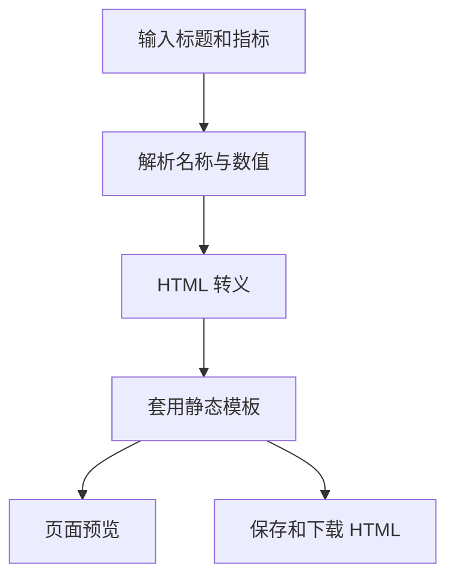

# 21 金融仪表盘生成器

这是一个模板驱动的本地 HTML 金融仪表盘生成器。用户输入仪表盘标题、核心指标和备注后，程序生成一个独立的 `finance_dashboard.html` 文件，并在 Streamlit 页面中预览。

本项目不调用大模型、不执行任意代码、不依赖外部沙箱服务，也不需要 Ollama、Docker 或 Podman。

## 功能

- 输入标题、指标和备注
- 使用 `名称=数值` 格式解析指标
- 在页面中预览生成结果
- 保存到项目的 `outputs/finance_dashboard.html`
- 直接下载 HTML 文件
- 对所有用户输入进行 HTML 转义，避免输入内容被当作标签或脚本执行

## 文件结构

```text
21-finance_dashboard_generator/
├── app.py           # Streamlit 页面和 HTML 模板
├── requirements.txt # Python 依赖
├── outputs/         # 生成的 HTML 文件
└── README.md        # 使用说明
```

## 安装依赖

```bash
cd finance-llm-agent-demos/21-finance_dashboard_generator
python3.11 -m pip install -r requirements.txt
```

## 启动

从仓库根目录运行：

```bash
./finance-llm-agent-demos/scripts/run_21_agent.sh
```

默认地址：`http://127.0.0.1:8501`。

如果端口被占用：

```bash
PORT=8502 ./finance-llm-agent-demos/scripts/run_21_agent.sh
```

也可以在项目目录直接运行：

```bash
cd finance-llm-agent-demos/21-finance_dashboard_generator
python3.11 -m streamlit run app.py
```

## 输入格式

仪表盘标题示例：

```text
投资组合风险监控
```

核心指标每行一条，使用第一个 `=` 分隔名称和值：

```text
组合收益率=12.4%
最大回撤=-8.1%
现金占比=18%
高风险事件=3
```

备注示例：

```text
本周重点关注财报季、利率预期和行业监管事件。
```

没有 `=`、名称为空或数值为空的行会被忽略，并在页面中给出提示。

## 使用流程



1. Streamlit 收集用户输入。
2. `parse_metrics()` 校验并解析指标。
3. `build_dashboard_html()` 对标题、指标和备注执行 HTML 转义。
4. 生成固定结构的静态 HTML，不执行用户输入中的代码。
5. 文件保存到 `outputs/finance_dashboard.html`，同时提供下载按钮。

## 输出文件

生成成功后，文件位于：

```text
finance-llm-agent-demos/21-finance_dashboard_generator/outputs/finance_dashboard.html
```

该文件可以直接用浏览器打开，也可以作为静态文件部署到普通 Web 服务器。每次生成会覆盖同名文件。

## 常见问题

### 页面提示没有有效指标

确认每行都包含 `=`，例如：

```text
收益率=12.4%
```

### 指标值包含等号

程序只按第一个等号拆分，因此下面的值仍会被完整保留：

```text
策略状态=条件=A，状态良好
```

### HTML 文件在哪里

默认保存在项目目录的 `outputs/finance_dashboard.html`，也可以点击页面中的“下载 HTML 文件”保存到本机其他位置。

### 是否需要配置 API Key

不需要。本项目是本地模板生成器，不调用 DeepSeek 或其他模型服务。

## 安全边界

- 生成器不会执行输入中的 HTML、JavaScript 或其他代码。
- 不要在仪表盘中写入未脱敏的个人信息、账户信息或内部机密。
- 输出数据完全来自用户输入，不能替代正式的风险系统或财务报表。
- 本项目仅用于技术学习和原型验证，不构成投资建议。
