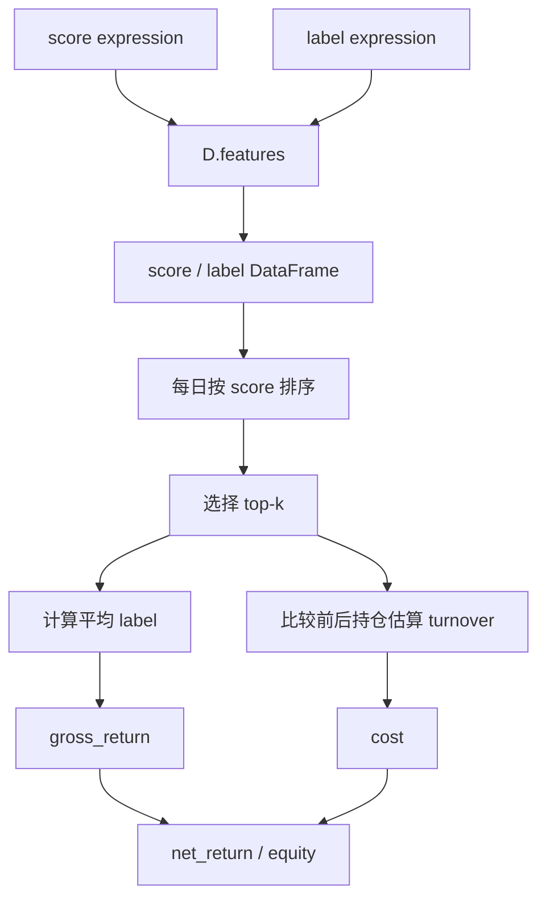
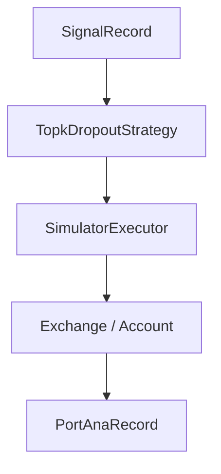

# 09：从 Qlib score 到简化 top-k 回测

## 学习目标

完成本节后，你应该能够把横截面 score 转成 top-k 持仓，计算简化换手和成本，并解释该结果为何不能替代 Qlib 原生成交仿真。成功运行时应看到逐日收益、净值和平均换手。

这一节仍然用 Qlib `D.features` 生成 score 和 label，但回测逻辑保持轻量。目的不是替代 Qlib 原生回测，而是先看清模型分数如何变成组合收益。

## 阅读前需要知道的业务概念

- **score**：每个交易日给每只标的打出的排序分数，不是已经实现的收益。
- **持仓**：当天决定买入并持有的标的集合。
- **等权组合**：每只入选标的使用相同资金权重。
- **毛收益**：尚未扣除交易成本的组合收益。
- **换手**：今天的持仓相对昨天改变了多少。
- **净收益**：毛收益减去调仓成本。
- **净值**：每天把净收益复利累乘后得到的资产变化轨迹。

本节研究的问题不是“因子是否相关”，而是：

```text
每天根据 score 真正选出 top-k 后，组合在扣除简化交易成本后表现如何？
```

## 先看一个手算例子

假设 `topk=2`、单边成本率为 `0.1%`。

第一天的横截面是：

| 标的 | score | 下一持有期收益 label | 是否入选 |
|---|---:|---:|---|
| A | 0.80 | 2.0% | 是 |
| B | 0.60 | 1.0% | 是 |
| C | 0.20 | -1.0% | 否 |

组合等权持有 A、B，因此：

```text
gross_return = (2.0% + 1.0%) / 2 = 1.5%
首次建仓 buys=2、sells=0
turnover = (2 + 0) / 2 = 1
cost = 1 × 0.1% = 0.1%
net_return = 1.5% - 0.1% = 1.4%
equity = 1 × (1 + 1.4%) = 1.014
```

第二天如果持仓从 `{A, B}` 变成 `{B, C}`，只卖出 A、买入 C：

```text
buys=1、sells=1
turnover = (1 + 1) / 2 = 1
```

如果两只全部替换，双边换手是 `2`，成本就是 `2 × cost_rate`。

## 图结构



## Python 文件逐段拆解

### `DEFAULT_SCORE` / `DEFAULT_LABEL`

`DEFAULT_SCORE` 是一个 Qlib 表达式，默认用 20 日动量作为排序信号。`DEFAULT_LABEL` 是下一持有期收益。

时间线必须先说明清楚：

```text
t 日收盘：计算 score
t+1 日：假设完成建仓
t+1 收盘到 t+2 收盘：用 label 表示本次持仓收益
```

因此默认标签写成：

```python
Ref($close, -2) / Ref($close, -1) - 1
```

它刻意跳过 `t` 到 `t+1` 的收益，避免假设自己能在看到 `t` 日收盘信号之前成交。

这两个表达式通过 `QLIB_SCORE_EXPR` 和 `QLIB_LABEL_EXPR` 覆盖。

### `load_features([score_expr, label_expr], ...)`

底层调用 `D.features`。Qlib 负责从 provider 读取字段、计算表达式并对齐 index。

### `topk`

脚本按每日横截面的 score 从高到低排序。内置数据只有五只 ETF，因此默认 `topk=2`；如果设为 50，实际上会把五只全部买入，score 排序就失去作用。

```python
picked = group.sort_values("score", ascending=False).head(topk)
```

这一步把预测层的 score 转成组合层的持仓集合。

### `turnover`

脚本比较今天和昨天的持仓集合：

```python
buys = current - previous
sells = previous - current
turnover = (len(buys) + len(sells)) / topk
```

这是简化估算，不处理成交量、涨跌停、现金和最小交易单位。完整版本见第 12 节。

这里采用双边换手：首次建仓为 `1`，全部替换持仓为 `2`。不同研究平台也可能报告单边换手，比较结果前必须先核对定义。

### `net_return`

```python
net_return = gross_return - turnover * cost_rate
```

这里演示成本对策略收益的影响。很多高 IC 信号会因为高换手和成本失效。

## 一次运行的完整执行轨迹

1. 初始化 Qlib。
2. `D.features` 计算 score 和 label。
3. 每个交易日选 top-k。
4. 估算换手和成本。
5. 输出累计净值和平均换手。

## 运行方式

```bash
QLIB_PROVIDER_URI=~/.qlib/qlib_data/cn_data python strategy_and_backtest.py
```

可选：

```bash
QLIB_TOPK=50
QLIB_COST_RATE=0.001
```

使用仓库内置五只 ETF 时，建议从下面的参数开始：

```bash
QLIB_TOPK=2 QLIB_COST_RATE=0.001 bash qlib-demos/script/run_09.sh
```

## 和第 12 节的区别

本节是教学用简化回测。第 12 节会使用 Qlib 原生：



## 常见坑

- 把 IC 当成组合收益。
- 忽略换手和成本。
- 用单标的做 top-k 横截面策略。
- 忘记区分信号、策略、成交和账户状态。
- 没有明确 score 形成时间、建仓时间和 label 覆盖的收益区间。
- `topk` 大于或等于整个标的池，导致排序信号没有实际作用。

## 学习检查

- 使用 0、0.001、0.003 三种成本率，比较最终净值。
- 解释集合换手估算遗漏了权重变化、成交限制和现金状态中的哪些部分。

## 下一步

进入 `10-config-driven-alpha-workflow`，把因子评估流程配置化。
