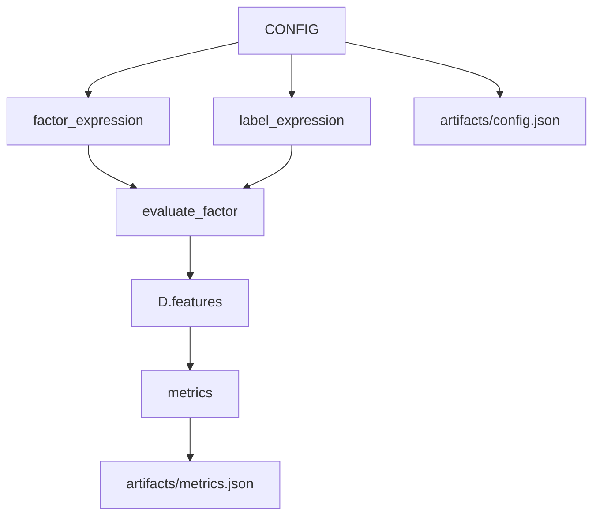

# 10：配置驱动的 Qlib 因子评估流程

## 学习目标

完成本节后，你应该能够用一份配置固定实验 ID、因子、标签和输出目录，重跑后比较配置与指标 artifact。成功运行时应生成配套的 `config.json` 与 `metrics.json`。

这一节用一个 Python `CONFIG` dict 串起因子评估。它不是完整 `qrun`，但体现了 Qlib 项目常见思想：研究对象由配置描述，执行逻辑保持稳定。

## 图结构



## Python 文件逐段拆解

### `CONFIG`

配置包含：

```python
{
    "experiment_id": "qlib_factor_eval_001",
    "factor_expression": "...",
    "label_expression": "...",
}
```

配置只保留真正参与本节计算的参数。`topk` 和 `cost_rate` 属于策略层，应放在第 9 或第 12 节，避免出现“配置里存在但实际没有生效”的参数。

### `init_qlib()`

配置只是描述实验，真正执行前仍要初始化 Qlib provider。没有 provider，表达式无法被确定性计算。

### `evaluate_factor(...)`

这是第 6 节的核心评估函数。配置驱动并不改变评估逻辑，只改变输入参数。

### `artifacts`

脚本写出：

```text
config.json
metrics.json
```

这对应真实研究中的两个关键产物：实验输入和实验输出。自动因子系统必须同时保存两者。

## 一次运行的完整执行轨迹

1. 读取 `CONFIG`。
2. 初始化 Qlib。
3. 用配置里的 factor/label 调用 `evaluate_factor`。
4. 创建 `artifacts/<experiment_id>/`。
5. 保存 config 和 metrics。

## 运行方式

```bash
QLIB_PROVIDER_URI=~/.qlib/qlib_data/cn_data python config_driven_alpha_workflow.py
```

## 核心原理

配置驱动的价值是复现和批量化：


Agent 可以生成候选表达式，但评估函数、标签定义、时间区间和输出格式必须稳定。

## 学习检查

- 复制一份配置并更改实验 ID 和因子窗口，比较两组 artifact。
- 解释为什么未参与计算的参数不应该出现在本节配置中。

## 下一步

进入 `11-alpha158-alpha360-feature-sets`，看 Qlib 官方预定义特征集合如何封装成 Handler。
