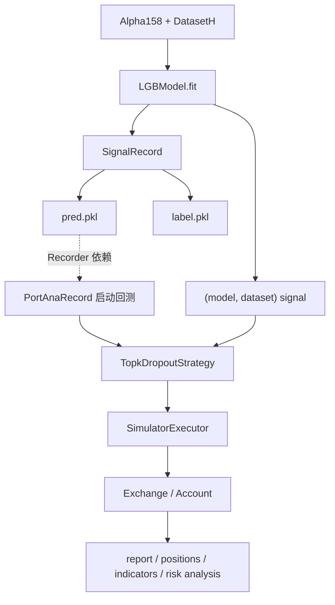
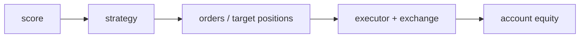

# 12：Qlib 原生组合回测

## 学习目标

完成本节后，你应该能够解释 Signal、Strategy、Executor、Exchange 和 Account 的职责边界，并通过 Recorder 生成组合报告。成功运行时应看到样本外组合序列和 portfolio analysis 指标。

这一节使用 Qlib 原生组合回测链路：训练模型、保存预测信号、用 `TopkDropoutStrategy` 生成交易决策，再由 `SimulatorExecutor` 和 `PortAnaRecord` 完成组合分析。

## 图结构



## Python 文件逐段拆解

### `build_dataset()`

构造 `Alpha158` handler 和 `DatasetH`。这一步给模型提供 feature / label，也给后续 signal 生成提供 test segment。

### `build_port_analysis_config(model, dataset)`

这个函数返回 Qlib portfolio analysis 配置，分三块：

```text
executor
strategy
backtest
```

这和 Qlib YAML workflow 里的 `port_analysis_config` 是同一类结构。

### `SimulatorExecutor`

`SimulatorExecutor` 是 Qlib 的回测执行器。它按 `time_per_step="day"` 推进交易日，维护交易日历和账户执行过程。

### `TopkDropoutStrategy`

策略读取预测信号，选 top-k 股票，并用 `n_drop` 控制每天最多替换多少持仓。它的作用是把 score 转成交易决策，而不是计算模型分数。

### `exchange_kwargs`

这里配置交易市场假设：

```text
deal_price
open_cost
close_cost
min_cost
limit_threshold
```

这些参数决定成交价格、交易成本和涨跌停限制。模型 IC 不包含这些约束，组合回测才包含。

### `SignalRecord`

`SignalRecord(model, dataset, recorder).generate()` 会对 `DatasetH` 的 test segment 调用模型预测，并把预测值和真实标签保存为两个 Recorder artifact：

```text
pred.pkl   模型预测分数
label.pkl  与预测行对齐的真实标签
```

注意文件名是 `label.pkl`，不是 `lable.pkl`。

#### `pred.pkl` 保存什么

`pred.pkl` 保存一个 pandas `DataFrame`。行索引是 `datetime` 和 `instrument` 组成的 `MultiIndex`，列名是 `score`：

```text
                          score
datetime   instrument
2024-01-02 sh510050    0.000111
           sh510300   -0.003552
           sh510500    0.001262
```

每一行表示模型在某个交易日对某个标的给出的预测分数。策略按同一天的 `score` 做横截面排序，分数越高，标的越靠近候选组合前部。

`score` 不是成交价格、确定收益率或买卖订单。它是否能转化为组合收益，还取决于策略规则、交易成本、成交限制和调仓频率。

#### `label.pkl` 保存什么

`label.pkl` 也是 pandas `DataFrame`，使用与 `pred.pkl` 相同的 `datetime/instrument` 两级索引，标签列名是 `LABEL0`：

```text
                         LABEL0
datetime   instrument
2024-01-02 sh510050   -0.006012
           sh510300   -0.007420
           sh510500   -0.007941
```

本例使用 `Alpha158`，其默认标签表达式是：

```text
Ref($close, -2) / Ref($close, -1) - 1
```

在日期 `t` 上，`Ref($close, -1)` 是下一交易日收盘价，`Ref($close, -2)` 是下下个交易日收盘价，所以该表达式计算 `t+1` 收盘到 `t+2` 收盘之间的收益率。它用来检验 `score` 对后续收益方向和排序的预测能力。

`label.pkl` 用于训练结果和信号质量评估，不参与本节的组合交易决策。回测时提前读取它会造成未来数据泄漏。

当前一次实际运行中，两个文件都是 `3070 × 1`，日期从 `2024-01-02` 到 `2026-07-17`。这是运行结果示例，不是固定规格；数据区间、交易日数量或标的池变化后，行数也会变化。

#### `.pkl` 是什么格式

`.pkl` 是 Python Pickle 二进制序列化文件常用的扩展名。Pickle 可以把 pandas `DataFrame` 等 Python 对象连同索引、列名和数据类型一起写入文件。扩展名只说明采用 Pickle 序列化，不规定内部对象必须是表格；其他 `.pkl` 文件也可能保存字典、列表或自定义对象。

它与 CSV、JSON、Parquet 的差别是：

| 格式 | 是否为文本 | 能否保留 pandas 对象结构 | 跨语言读取 | 适合用途 |
| --- | --- | --- | --- | --- |
| Pickle (`.pkl`) | 否 | 可以直接保留 | 较弱 | Python 实验中快速保存和恢复对象 |
| CSV (`.csv`) | 是 | 索引和类型通常需要重新处理 | 强 | 简单二维数据交换 |
| Parquet (`.parquet`) | 否 | 可保留表格 schema，但不是任意 Python 对象 | 强 | 大型表格存储和跨工具分析 |

优先通过 Recorder 读取 artifact：

```python
recorder = R.get_recorder(recorder_id="<run_id>", experiment_name="qlib_demo_native_backtest")
pred = recorder.load_object("pred.pkl")
label = recorder.load_object("label.pkl")

print(type(pred))
print(pred.index.names)
print(pred.columns)
print(pred.head())
```

如果已经知道本地文件路径，也可以直接读取：

```python
import pandas as pd

pred = pd.read_pickle("path/to/pred.pkl")
label = pd.read_pickle("path/to/label.pkl")
```

Pickle 不是安全的数据交换格式。`pickle.load()` 或 `pd.read_pickle()` 可能执行文件中携带的恶意代码，因此只能读取自己生成或来源可信的 `.pkl` 文件。它还依赖 Python 和相关库的对象定义；需要长期保存或跨语言共享时，表格数据更适合导出为 Parquet。

### `PortAnaRecord`

`PortAnaRecord` 依赖并读取 `pred.pkl`，然后运行 Qlib 原生 backtest。本例的 strategy 配置使用 `signal=(model, dataset)`，因此策略从模型和数据集构造同一批 test signal；如果将配置写成 `signal="<PRED>"`，`PortAnaRecord` 才会把占位符替换为已保存的 `pred.pkl` 内容。

组合回测完成后，它会保存：

```text
report_normal_1day.pkl
positions_normal_1day.pkl
indicators_normal_1day.pkl
port_analysis_1day.pkl
```

## 一次运行的完整执行轨迹

1. 初始化 Qlib。
2. 构造 `Alpha158 + DatasetH`。
3. 训练 `LGBModel`。
4. `SignalRecord` 保存预测信号。
5. `PortAnaRecord` 用 Qlib strategy/executor/exchange/account 跑回测。
6. 脚本加载并打印 portfolio report 和 risk analysis。

## 运行方式

```bash
QLIB_PROVIDER_URI=~/.qlib/qlib_data/cn_data python native_backtest_architecture.py
```

可选：

```bash
QLIB_TOPK=50
QLIB_N_DROP=5
QLIB_BENCHMARK=SH000300
QLIB_DEAL_PRICE=close
```

## 核心原理

预测和投资组合是两个问题：



好 IC 不等于好策略。成本、换手、成交限制和 benchmark 都会改变最终表现。

## 常见坑

- 把 `pred.pkl` 当成回测结果。
- 忽略 `deal_price` 与信号生成时间的关系。
- benchmark 和 instrument pool 不匹配（Qlib 原生策略参数名为 `market`）。
- top-k 太小导致组合过度集中。

## 学习检查

- 修改 `topk/n_drop`，比较换手和组合指标。
- 将交易成本设为零并与默认值比较，指出成本在哪一层生效。

## 下一步

进入 `13-custom-data-provider`，学习如何把自己的数据整理成 Qlib provider。
