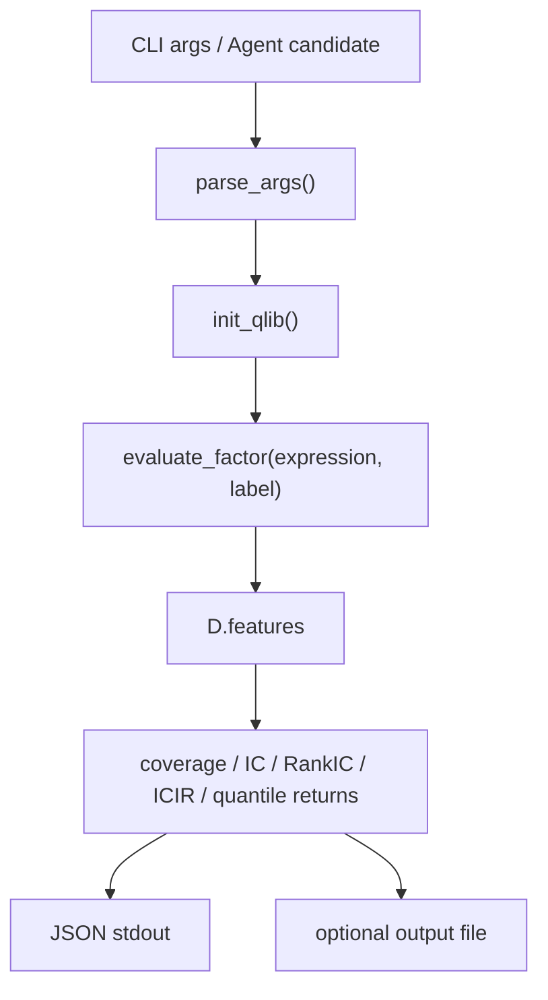
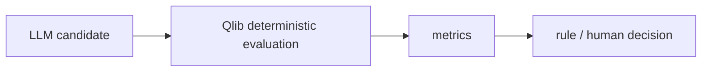

# 14：自动因子评估服务

## 学习目标

完成本节后，你应该能够通过稳定 CLI 调用确定性因子评估，处理成功和失败 JSON、退出码、输出文件及小样本告警。成功输出包含 `schema_version`、`status` 和 `metrics`；失败输出包含结构化 `error`。

这一节把 Qlib 数据读取、表达式计算、标签构造和指标评估收口成一个 CLI。它是后续 Agent / LangGraph 自动因子挖掘系统可以调用的确定性入口。

一句话理解：**输入一个候选因子公式，Qlib 用历史数据检查它和未来收益是否存在稳定关系，最后返回机器可读的 JSON 报告。**

第 14 节没有发明新的因子算法，也不训练模型。它复用第 6 节的评估逻辑，只增加稳定的命令行参数、JSON schema、错误处理、退出码和可选输出文件。这样，人、批处理脚本或 Agent 都可以调用同一个评估入口，而不需要修改 Python 源码。

## 它在完整研究流程中的位置

```text
LLM / Agent 生成候选因子
  -> 第 14 节快速计算 IC、RankIC 和分组收益
  -> 按统一规则筛选候选
  -> 用候选特征训练模型
  -> 第 12 节执行组合回测
  -> 检查收益、换手、成本和回撤
```

第 14 节回答“这个因子和未来收益有没有统计关系”，第 12 节回答“信号经过策略、成交和成本后能不能形成可用的组合”。因子 IC 较好不等于策略一定盈利，所以两步不能互相替代。

## 图结构



## Python 文件逐段拆解

### `parse_args()`

定义 CLI 参数：

```text
--expression
--label
--quantiles
--min-cross-section
--output
```

这让外部系统可以把候选因子表达式作为参数传入，而不是修改源码。

### `init_qlib()`

服务启动后先初始化 Qlib provider。没有 provider 时直接失败，因为评估必须由 Qlib 数据层确定性计算。

### `evaluate_factor(args.expression, args.label)`

复用第 6 节的核心函数。这样 CLI 只是薄封装，指标逻辑集中在一个地方，便于测试和复用。

### `validate_request()`

在访问 Qlib 数据前检查空表达式、分组数、最小横截面，并拒绝候选因子中明显的负数 `Ref` 偏移。标签允许负数偏移，因为标签负责描述未来收益；可交易因子不允许读取未来。

### `evaluate_request()`

这是第 15 节批处理器复用的单因子函数契约。它只负责校验和计算，不负责批量调度，避免批处理层重新实现 IC 等数值逻辑。

### `--output`

如果传入输出路径，脚本把 JSON metrics 写入文件；否则打印到 stdout。Agent 调用时通常读取 stdout 或指定 output file。

## 一次运行的完整执行轨迹

1. Agent 或用户传入候选表达式。
2. CLI 解析参数。
3. 初始化 Qlib。
4. 调用 `evaluate_factor`。
5. 输出 JSON 指标。
6. 上游系统根据指标决定接受、拒绝或继续观察。

## 用默认表达式理解一次评估

默认候选因子是：

```text
$close / Ref($close, 20) - 1
```

它表示“今日收盘价相对 20 个交易日前的涨幅”，也就是 20 日动量。默认标签是：

```text
Ref($close, -5) / $close - 1
```

它表示“从今天到 5 个交易日后的收益率”。`Ref` 的正数偏移读取历史，负数偏移读取未来，因此负数偏移只能用于评估标签，不能放进可交易因子。

程序实际检验的问题是：

> 过去 20 日涨幅较高的标的，未来 5 日收益是否也倾向于较高？

假设某个交易日有下面五只 ETF：

| ETF | 20 日动量 | 未来 5 日收益 |
| --- | ---: | ---: |
| A | 8% | 3% |
| B | 5% | 2% |
| C | 1% | 0% |
| D | -2% | -1% |
| E | -6% | -3% |

这一天因子值与未来收益的顺序基本一致，因此 IC 和 RankIC 都会是正数。程序会在每个满足最小横截面要求的交易日重复这个计算，再对每日结果做时间序列汇总。

这里计算的是“同一天、不同标的之间”的横截面相关性，不是单只 ETF 沿时间方向的相关性。

## 运行方式

```bash
QLIB_PROVIDER_URI=~/.qlib/qlib_data/cn_data \
python factor_evaluation_service.py \
  --expression '$close / Ref($close, 20) - 1' \
  --label 'Ref($close, -5) / $close - 1'
```

输出到文件：

```bash
python factor_evaluation_service.py \
  --expression '$close / Ref($close, 20) - 1' \
  --output artifacts/mom20.json
```

## 输出 schema

```json
{
  "schema_version": "1.0",
  "status": "ok",
  "metrics": {
    "expression": "$close / Ref($close, 20) - 1",
    "label": "Ref($close, -5) / $close - 1",
    "rows": 12345,
    "coverage": 0.98,
    "cross_section_median": 300,
    "ic_days": 240,
    "ic_mean": 0.02,
    "ic_std": 0.05,
    "ic_positive_ratio": 0.58,
    "ic_t_stat": 6.2,
    "rank_ic_mean": 0.03,
    "icir_daily": 0.4,
    "icir_annualized": 6.349803,
    "quantile_return_mean": {},
    "warnings": []
  }
}
```

主要字段可以这样理解：

| 字段 | 含义 | 观察重点 |
| --- | --- | --- |
| `coverage` | 因子和标签同时有效的样本比例 | 太低说明缺失值较多，结果代表性不足 |
| `cross_section_median` | 每个交易日有效标的数量的中位数 | 横截面太小会让相关性很不稳定 |
| `ic_mean` | 每日 Pearson IC 的平均值 | 看因子值和未来收益是否存在线性关系 |
| `rank_ic_mean` | 每日排序相关性的平均值 | 看因子排序能否对应未来收益排序 |
| `ic_positive_ratio` | IC 为正的交易日比例 | 看预测方向是否经常保持一致 |
| `ic_t_stat` | IC 均值的基础 t 统计量 | 仅作初步诊断，未处理自相关等问题 |
| `icir_daily` | IC 均值除以 IC 标准差 | 同时衡量强度和稳定性 |
| `icir_annualized` | 按 252 个交易日年化的 ICIR | 便于统一展示，不代表真实投资收益 |
| `quantile_return_mean` | 各因子分组的平均未来收益 | 看低分组到高分组是否呈现单调变化 |
| `warnings` | 样本规模等风险提示 | 告警不阻止输出，但必须纳入判断 |

例如：

```json
"quantile_return_mean": {
  "0": -0.001,
  "1": 0.0002,
  "2": 0.0015
}
```

`0` 是低因子组，`2` 是高因子组。收益随分组上升说明因子具有一定单调性。负 IC 也不一定代表因子完全无用：如果方向长期稳定为负，它可能是一个需要反向使用的信号。

错误返回 `status: "error"`、稳定的 `error.code`、异常类型和消息。参数或未来数据校验失败使用退出码 2；Qlib 环境、表达式计算或输出文件失败使用退出码 1。输出禁止出现非标准 JSON 值 `NaN` 和 `Infinity`。

常见错误码：

| `error.code` | 含义 |
| --- | --- |
| `invalid_input` | 参数为空、控制参数越界或因子读取未来数据 |
| `environment_error` | Qlib 包、provider 或初始化环境不可用 |
| `evaluation_error` | Qlib 表达式解析或指标计算失败 |
| `output_error` | JSON 输出文件无法创建或写入 |

调用方可以用固定规则处理结果：

```python
if result["status"] == "ok":
    inspect(result["metrics"])
else:
    record_failure(result["error"])
```

## 核心原理

LLM/Agent 可以生成候选，但不能凭语言判断因子好坏：



数值计算、时间对齐、缺失处理和评估记录必须由确定性程序完成。

## 常见坑

- 让 Agent 直接解释因子好坏，不跑数据。
- 没有固定 label 和时间区间，导致候选不可比。
- 单标的评估 IC，缺少横截面意义。
- 不保存失败候选。

## 当前内置数据的限制

仓库默认只有五只宽基 ETF，而横截面 IC 依赖“同一天有足够多的不同标的”。五只标的可以清楚演示计算和服务接口，但远不足以据此证明因子在真实股票池中有效。

因此默认结果通常会包含横截面中位数少于 30 的告警。此时应把输出理解为接口和计算流程演示，而不是投资结论。正式筛选因子时还需要更大的标的池、固定且可比较的时间区间，以及样本外组合回测。

## 学习检查

- 分别传入合法表达式和非法表达式，检查 JSON 的 `status` 与进程退出码。
- 使用 `--output` 保存结果，并确认 stdout 与文件具有相同 schema。
- 设计一个包含三个候选表达式的批处理调用，记录成功和失败候选。
